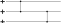

.. Copyright 2023, QC Design GmbH and the plaquette contributors
   SPDX-License-Identifier: Apache-2.0

.. _circuits-guide:

Creating and simulating circuits by hand
========================================

This tutorial explains how to define and simulate Clifford circuits
using plaquette. It can be useful if you want to simulate QEC using a
custom circuit or if you want to analyze specific details of a circuit
generated by ``plaquette``. ``plaquette`` has the ability to automatically
generate circuits for all built-in and custom-defined QEC codes (see
:doc:`/advanced/codes/index` for further details on that matter).

Four ways to define a circuit
-----------------------------

There are four equivalent ways to define a circuit. Depending on the
use-case, one can be more convenient than the others.

.. seealso:: :ref:`circuits-ref` for details on the supported gates and
   instructions.

Creating a circuit from string representation
~~~~~~~~~~~~~~~~~~~~~~~~~~~~~~~~~~~~~~~~~~~~~

>>> import numpy as np
>>> import plaquette
>>> from plaquette import circuit
>>> plaquette.rng = np.random.default_rng(1234567890)
>>> circ = circuit.Circuit.from_str("""
...     X 0 1
...     Y 2 3
... """)
>>> print(circ)
X 0 1
Y 2 3

.. note:: :func:`print` uses the :meth:`Circuit.__str__` method to convert the
   circuit to a string.

Appending to circuit from string representation
~~~~~~~~~~~~~~~~~~~~~~~~~~~~~~~~~~~~~~~~~~~~~~~

>>> circ = circuit.Circuit()  # empty circuit
>>> circ.append_from_str("""
...     X 0 1
...     Y 2 3
... """)
>>> print(circ)
X 0 1
Y 2 3

Appending individual gates to circuit
~~~~~~~~~~~~~~~~~~~~~~~~~~~~~~~~~~~~~

>>> circ = circuit.Circuit()
>>> circ.append("X", 0, 1)
>>> circ.append("Y", 2, 3)
>>> print(circ)
X 0 1
Y 2 3

Using CircuitBuilder
~~~~~~~~~~~~~~~~~~~~

If you prefer a more imperative approach, :class:`.CircuitBuilder` is the
tool you're looking for.

>>> circ = circuit.Circuit()
>>> c = circuit.CircuitBuilder(circ)
>>> c.X(0, 1)
>>> c.Y(2, 3)
>>> print(circ)
X 0 1
Y 2 3

Example circuits
----------------

If you know your requirements, you can build your own circuits with the
methods above that can be later simulated just as if they were made from the
internal :term:`QECC` defined in ``plaquette``.

.. note:: if you want to dig in and analyse the internal :class:`.QuantumState`
   of underlying backend when using ``"clifford"`` backend, you can do so by
   inspecting the :attr:`~.Device.state` attribute. If you are *even more*
   adventurous, this state has a :attr:`~.QuantumState.tableau` attribute which
   is the lowest-level representation of the stabiliser state, which you can
   manipulate with the functions from the :mod:`.pauli` module.

.. hint:: the ``"clifford"`` backend implements the Python iterator protocol,
   which allows you to step through each instruction individually and take
   action at every step. This is useful if you want to implement some
   complicated logic in the circuit which is not easy (or outright possible) to
   do with the available :ref:`circuit instruction <circuits-ref>`.

4-qubit GHZ state
~~~~~~~~~~~~~~~~~

The following example prepares a GHZ state on four qubits and measures
it 10 times.

.. note:: The total number of qubits is implicitly determined from the
   qubits on which the gates act.

>>> from plaquette import circuit, Device
>>> circ = circuit.Circuit.from_str("""
... R 0 1 2 3
... H 0
... CX 0 1
... CX 1 2
... CX 2 3
... M 0 1 2 3
... """)
>>> dev = Device("clifford")
>>> for _ in range(10):
...     dev.run(circ)
...     raw, _ = dev.get_sample()
...     print(raw)
[0 0 0 0]
[1 1 1 1]
[0 0 0 0]
[0 0 0 0]
[1 1 1 1]
[1 1 1 1]
[1 1 1 1]
[1 1 1 1]
[0 0 0 0]
[1 1 1 1]

Correlated errors
~~~~~~~~~~~~~~~~~

>>> probab = []
>>> for p1 in "IXYZ":
...     for p2 in "IXYZ":
...         if p1 == "X" and p2 == "X":
...             # Set probability for XX to 0.5
...             probab.append(0.5)
...         else:
...             # Set probability for all other two-qubit Paulis to 0.0.
...             probab.append(0.0)
>>>
>>> circ = circuit.Circuit()
>>> c = circuit.CircuitBuilder(circ)
>>>
>>> # Do not pass the first element of `probab` (probability for II).
>>> c.e_pauli2(*probab[1:], 0, 1)
>>> c.M(0, 1)
>>>
>>> dev = Device("clifford")
>>>
>>> for _ in range(10):
...     dev.run(circ)
...     raw, _ = dev.get_sample()
...     print(raw)
[0 0]
[1 1]
[1 1]
[1 1]
[1 1]
[0 0]
[1 1]
[1 1]
[1 1]
[1 1]

Example: Circuit with heralded erasure (aka loss)
~~~~~~~~~~~~~~~~~~~~~~~~~~~~~~~~~~~~~~~~~~~~~~~~~

The following circuit contains the instruction ``E_ERASE``, which
represents a :ref:`Gate E_ERASE`. With the given probability of
``0.5``, an erasure channel is applied on each qubit. Whether the
erasure channel was applied or not is heralded in ``erasure``.

>>> n_qubits = 20
>>>
>>> circ = circuit.Circuit()
>>>
>>> for i in range(n_qubits):
...     circ.append("E_ERASE", 0.5, i)
>>> for i in range(n_qubits):
...     circ.append("M", i)
>>>
>>> dev = Device("clifford")
>>>
>>> for _ in range(5):
...     dev.run(circ)
...     raw, erasure = dev.get_sample()
...     print(
...         "Erased:             ", erasure.astype(int),
...         "Sum:", erasure.sum()
...     )
...     print(
...         "Measurement result: ", raw,
...         "Sum:", raw.sum()
...     )
Erased:              [1 1 1 0 1 0 0 1 1 1 0 1 1 1 1 0 0 0 1 1] Sum: 13
Measurement result:  [0 0 1 0 1 0 0 1 0 0 0 1 1 0 0 0 0 0 1 1] Sum: 7
Erased:              [0 1 0 1 1 1 1 0 1 0 0 1 0 0 0 0 0 1 1 0] Sum: 9
Measurement result:  [0 0 0 1 0 1 0 0 0 0 0 0 0 0 0 0 0 0 0 0] Sum: 2
Erased:              [1 0 0 1 0 1 1 0 1 0 1 0 0 1 1 1 0 0 0 1] Sum: 10
Measurement result:  [0 0 0 1 0 0 0 0 0 0 0 0 0 1 1 1 0 0 0 1] Sum: 5
Erased:              [1 1 1 0 1 1 1 0 0 0 0 1 1 1 1 0 1 1 0 0] Sum: 12
Measurement result:  [1 1 1 0 1 0 0 0 0 0 0 1 1 0 1 0 1 0 0 0] Sum: 8
Erased:              [1 0 1 1 0 0 1 0 0 1 1 1 1 1 1 1 0 0 0 1] Sum: 12
Measurement result:  [0 0 0 0 0 0 0 0 0 0 1 0 0 0 0 1 0 0 0 0] Sum: 2

The entries of the arrays correspond all the ``E_ERASE`` and ``M``
instructions in the circuit.

As expected, about half the qubits are erased and about half of the
erased qubits see an ``X`` or ``Y`` error.

.. seealso:: :ref:`Gate E_ERASE`

3-qubit linear cluster state
~~~~~~~~~~~~~~~~~~~~~~~~~~~~

.. sectionauthor:: Matteo Santandrea <matteo@qc.design>

Let's generate the following 3-qubit linear cluster state.

   A linear 3-qubit cluster state in circuit representation

First, we create a circuit with the :class:`.CircuitBuilder`

>>> circ = circuit.Circuit()
>>> c = circuit.CircuitBuilder(circ)
>>> c.H(0)
>>> c.H(1)
>>> c.H(2)
>>> c.CZ(0,1)
>>> c.CZ(1,2)

Then, we simulate it.

.. important:: Creating a device does not actually run anything. You can use
   :meth:`.Device.run` to actually run the circuit, followed by calling
   :meth:`.Device.get_sample` even if you have no measurement gates set up.

>>> dev = Device("clifford")
>>> dev.run(circ)  # used to actually run the circuit
>>> dev.get_sample()
(array([], dtype=uint8), None)

Now we can print the internal backend state as a list of stabilisers that
define such state

>>> from plaquette.pauli import state_to_stabiliser_string
>>> d, s = state_to_stabiliser_string(dev.state.tableau, show_identities=True)
>>> print("Stabilizers: ", s)
Stabilizers:  ['+XZI', '+ZXZ', '+IZX']

which are the stabilisers of the 3-qubit linear cluster state.

A classic: the teleportation circuit
~~~~~~~~~~~~~~~~~~~~~~~~~~~~~~~~~~~~

.. sectionauthor:: Matteo Santandrea <matteo@qc.design>

Since ``plaquette``'s local backends only supports Clifford operations and
:math:`\lvert0\rangle` initial states, we will try to teleport the
:math:`\lvert1\rangle` initial state, using the following scheme

We expect as output of the circuit the state

.. math::

   X^m H\lvert1\rangle = X^m \lvert-\rangle

Therefore, depending on the output of the computation, the final state is

.. math::

   m = 0 \rightarrow s' = \lvert-\rangle

and

.. math::

   m = 1 \rightarrow s' = -\lvert-\rangle

To teleport the initial state, we need to "undo" the gates, i.e. apply
:math:`H X^m`. Translated into a ``plaquette`` simulation, this means

>>> # Teleport the initial state.
>>> circ = circuit.Circuit()
>>> c = circuit.CircuitBuilder(circ)
>>> # Initialize the first qubit to |1>
>>> c.X(0)
>>> # Stabilizers: <-ZI, IZ>
>>> # Create the cluster state
>>> c.H(1)
>>> # Stabilizers: <-ZI, IX>
>>> c.CZ(0,1)
>>> # Stabilizers: <-ZI, ZX>
>>> c.H(0)
>>> # Stabilizers: <-XI, XX>
>>> c.M(0)
>>> # Stabilizers: <mZ, -IX>
>>> dev = Device("clifford")
>>> dev.run(c)
>>> result = dev.get_sample()[0][0]
>>> d, s = state_to_stabiliser_string(dev.state.tableau, show_identities=True)
>>> print("Measurement. Result: ", result)
Measurement. Result:  1
>>> print("Stabilizers: ", s)
Stabilizers:  ['-ZI', '-IX']

Now we "undo" the gates. We first update the circuit:

>>> if result:
...     c.X(1)
>>> c.H(1)

and then load it into the device:

>>> dev.circuit = c.circ  # we have to take the circuit in the builder
>>> dev.run(c.circ)
>>> result = dev.get_sample()[0][0]
>>> d, s = state_to_stabiliser_string(dev.state.tableau, show_identities=True)
>>> print("Measurement. Result: ", result)
Measurement. Result:  1
>>> print("Stabilizers: ", s)
Stabilizers:  ['-ZI', '-IZ']

As you can see, the output state of the second qubit (regardless the
intermediate step) is always stabilized by :math:`\langle-IZ\rangle`, i.e. is
in the state :math:`\lvert1\rangle`.
