.. Copyright 2023, It'sQ GmbH and the plaquette contributors
   SPDX-License-Identifier: Apache-2.0

.. _codes-guide:

Working with codes in ``plaquette``
===================================

.. sectionauthor:: Marcello Massaro

This guides explains everything about error correction codes in
``plaquette``. The first half shows all built-in codes and discusses how to
access different properties of the built-in codes. The second half
discusses how to define custom codes. For the purpose of defining custom
codes, ``plaquette`` provides a lattice which makes it easy to identify qubits
and define stabilizers using lattice coordinates. Throughout this tutorial,
we will assume that the following imports are implicitly added to each code
snippet.

>>> import matplotlib.pyplot as plt
>>> from plaquette import codes, visualizer

Selecting a pre-defined code
----------------------------

Selecting a pre-defined error correction code is accomplished with a
single line.

>>> code = codes.LatticeCode.make_rotated_planar(n_rounds=1, size=4)
>>> vis = visualizer.LatticeVisualizer(code)
>>> vis.draw_lattice_mpl()

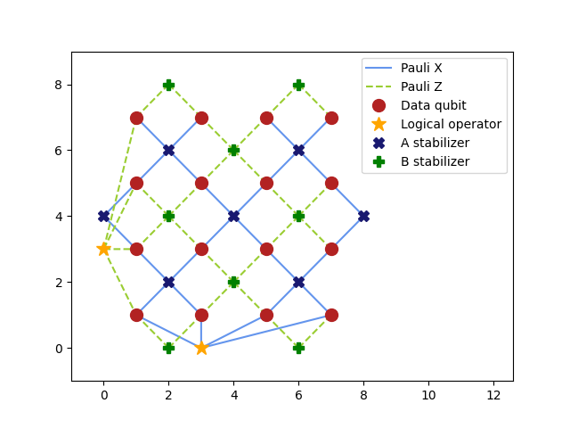

   Planar code of size 4

An example usage of a predefined code can be found in the :doc:`/quickstart`.

Built-in codes
--------------

All codes are made with the following snippet

.. code-block::
   :emphasize-lines: 1

   code = codes.LatticeCode.make_code(n_rounds=1, size=3)
   vis = visualizer.LatticeVisualizer(code)
   vis.draw_lattice().show()

where ``make_code`` is one of the available class-methods of
:class:`.LatticeCode`. Additionally, these plots are snapshots of the
interactive plotting backend of ``plaquette``, which uses
`Plotly <https://plotly.com>`_ behind the scenes. It will open a new browser
window with the plot if you are inside a script, otherwise it will show a
Jupyter widget if you're using a notebook.

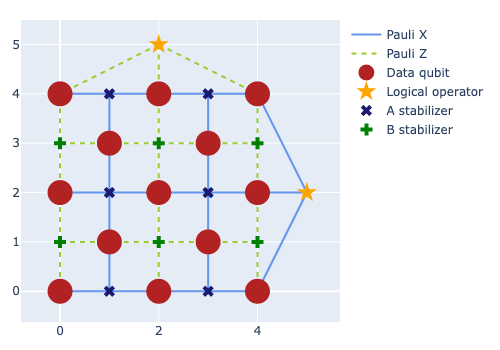

   Planar surface code (:meth:`.LatticeCode.make_planar`)

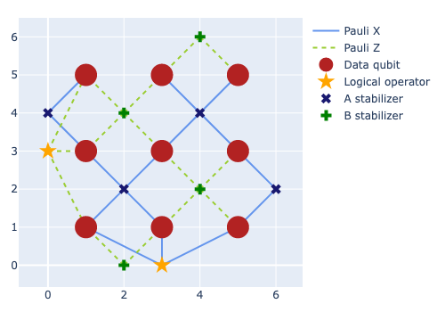

   Rotated planar surface code (:meth:`.LatticeCode.make_rotated_planar`)

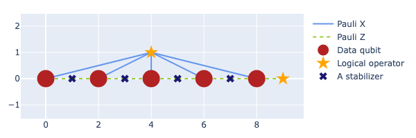

   Repetition code (:meth:`.LatticeCode.make_repetition`)

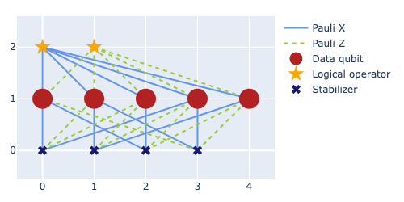

   The "five qubit" surface code (:meth:`.LatticeCode.make_five_qubit`)

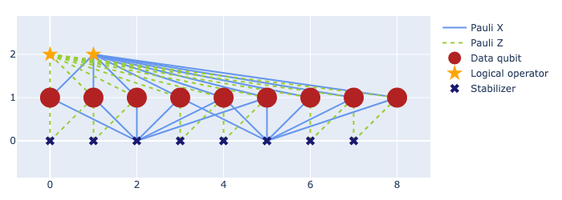

   Shor 9-qubit code (:meth:`.LatticeCode.make_shor`)

Basic code properties
---------------------

The remainder of this page discusses internal properties of error
correction codes and also shows how to define custom codes.

The figures above show all the properties of the stabilizer code. There
are four kinds of vertices:

-  Physical data qubits;
-  Stabilizer generators of the *primal* group;
-  Stabilizer generators of the *dual* group;
-  Logical operators.

Stabilizer generators are split into two groups only for the purposes of
visualisation. The QEC simulation does not make use of the division into
two groups [#]_.

Associated to each vertex there are different properties:

-  Lattice position
-  Data qubit index
-  Extended qubit index
-  Stabilizer generator index
-  Name of the logical operator
-  Logical operator index (e.g. “Logical 0”)

The field “extended qubit index” deserves an explanation because it is
present for both data qubits and stabilizer generators and logical
operators. The extended qubit index enumerates all the qubits necessary
in a simulation, which include:

-  Data qubits used by the code.
-  Ancilla qubits used to measure stabilizer generators.
-  Ancilla qubits used to measure logical operators.

In order to discuss further details around codes, we switch to a smaller
code with just five data qubits and four stabilizer generators:

>>> code = codes.LatticeCode.make_planar(n_rounds=1, size=2)
>>> vis = visualizer.LatticeVisualizer(code)
>>> vis.draw_lattice_mpl()

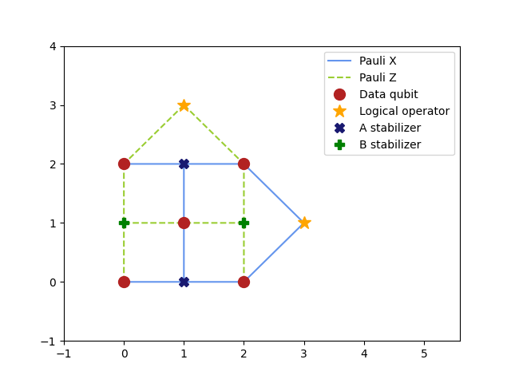

   Cute, isn't it?

``code`` is an instance of :class:`~plaquette.codes.LatticeCode`. The created
stabiliser generators are accessible through
:attr:`~.StabilizerCode.stabilisers`, while the number of data, logical, and
extended qubits are available through the
:meth:`.StabilizerCode.n_data_qubits`,
:meth:`.StabilizerCode.n_logical_qubits`, and
:meth:`.StabilizerCode.n_ext_qubits`,
respectively. In our case, there's 11 extended qubits (vertices on the graph)

>>> code.n_ext_qubits
11

Each extended qubit belongs to one of three categories:

data qubits
   used to store the information of the logical qubit we want to preserve.
logical qubits
   the actual logical qubits that the code defines.
ancilla qubits
   each stabiliser implicitly defines an ancilla qubit used to measure its
   parity.

You can access the logical operators via :attr:`.StabilizerCode.logical_x` and
:attr:`.StabilizerCode.logical_z`, and you can print a string representation of
them via the :mod:`.pauli` module.

>>> from plaquette import pauli
>>> for op in code.logical_x:
...     print(pauli.pauli_to_string(op))
+IIIXX

The code lattice
----------------

Qubits can be identified by one of several different indices, or more
conveniently using lattice positions. The lattice information is stored
in the attribute :attr:`.LatticeCode.lattice`.

Data qubit, stabilizer generator (ancillas) and logical operator indices can be
translated to lattice positions:

>>> lattice = code.lattice
>>> lattice.dataqubits[2]
DataVertex(pos = (1, 1), ext_idx = 2, data_idx = 2)
>>> lattice.stabgens[0]
StabGenVertex(pos = (0, 1), ext_idx = 5, stab_idx = 0)
>>> lattice.logical_ops[1]
LogicalVertex(pos = (1, 3), ext_idx = 10, log_idx = 1)

Lattice positions can be translated back to all types of indices, by accessing
the underlying square "grid":

>>> grid = lattice.lattice  # yes, twice
>>> grid[1, 1]
DataVertex(pos = (1, 1), ext_idx = 2, data_idx = 2)

Extended qubit indices can also be translated back and forth:

>>> lattice.equbits[7]
StabGenVertex(pos = (1, 2), ext_idx = 7, stab_idx = 2)

It is also possible to view all edges (:attr:`.latticebase.Vertex.edges`) and
neighbouring vertices (:attr:`.latticebase.Vertex.neighbours`) of a given
vertex, e.g.:

>>> grid[1, 2].neighbours
[DataVertex(pos = (1, 1), ext_idx = 2, data_idx = 2), DataVertex(pos = (2, 2), ext_idx = 4, data_idx = 4), DataVertex(pos = (0, 2), ext_idx = 1, data_idx = 1)]

Defining custom codes
---------------------

It's probably more interesting to have a look at how to define *custom* codes.
As an example, we will make the planar code that we have seen a few times
from scratch.

We start by creating an instance of :class:`.CodeLattice`:

>>> from plaquette.codes import latticebase
>>> code_l = latticebase.CodeLattice((4, 4))

Positions of vertices in the lattice are restricted to tuples of
integers and ``(4, 4)`` specifies that all positions must be between
``(0, 0)`` and ``(3, 3)`` (inclusive). Specifically, ``(4, 4)`` is the
shape of the :attr:`.CodeLattice.lattice` array.

Let's add some *data* qubits to the lattice:

>>> code_l.add_data((1, 1))
>>> code_l.assign_indices()
>>> code_l.lattice
array([[None, None, None, None],
       [None, DataVertex(pos = (1, 1), ext_idx = 0, data_idx = 0), None,
        None],
       [None, None, None, None],
       [None, None, None, None]], dtype=object)

.. important:: Calling :meth:`.CodeLattice.assign_indices` after adding items
   to the lattice makes sure that all qubit and other indices are assigned.

We proceed by adding the remaining vertices to the lattice:

>>> for pos in [(0, 0), (0, 2), (2, 0), (2, 2)]:
...      code_l.add_data(pos)
>>> code_l.add_stabgen((0, 1), latticebase.StabGroup.A)  # primal
>>> code_l.add_stabgen((2, 1), latticebase.StabGroup.A)
>>> code_l.add_stabgen((1, 0), latticebase.StabGroup.B)  # dual
>>> code_l.add_stabgen((1, 2), latticebase.StabGroup.B)
>>> code_l.add_logical((0, 3), "First logical (X)")
LogicalVertex(pos = (0, 3), ext_idx = -9223372036854775807, log_idx = -9223372036854775807)
>>> code_l.add_logical((3, 0), "Second logical (Z)")
LogicalVertex(pos = (3, 0), ext_idx = -9223372036854775807, log_idx = -9223372036854775807)
>>> code_l.assign_indices()
>>> vis = visualizer.LatticeVisualizer(code_l)
>>> vis.draw_lattice_mpl()

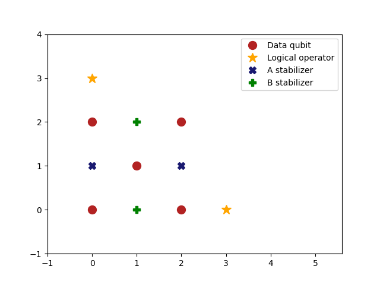

   Our custom planar code! Notice the absence of edges.

The vertex positions are used for drawing the figure. They are also used
to define edges in the next step, but they have no further impact on the
definition of the resulting stabilizer code.

The names assigned to logical operators are arbitrary strings, which will show
up when hovering with the Plotly backend. The logical operator which is added
first is assumed to be logical X and the second one is assumed to be logical Z.
If there are multiple logical qubits, logical operators have to be
specified in the order ``X1 Z1 X2 Z2 ...``.

.. seealso:: :attr:`~plaquette.codes.latticebase.CodeLattice.logical_ops`.

Vertices specify which qubits and operators exist. In order to define
which operators act on which qubits, we add edges to the figure.

>>> l = code_l.lattice
>>> # First X stabilizer
>>> code_l.add_edge(l[0, 0], l[0, 1], latticebase.Pauli.X)
>>> code_l.add_edge(l[1, 1], l[0, 1], latticebase.Pauli.X)
>>> code_l.add_edge(l[0, 2], l[0, 1], latticebase.Pauli.X)
>>> code_l.assign_indices()
>>> # we need to reset the visualizer
>>> vis = visualizer.LatticeVisualizer(code_l)
>>> vis.draw_lattice_mpl()

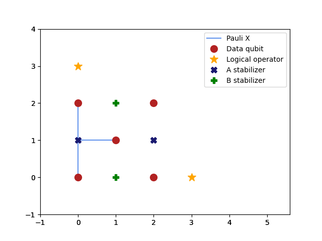

   Same as before, but with some edges.

Specifying the remaining edges takes a few lines:

>>> l = code_l.lattice
>>> # Second X stabilizer
>>> code_l.add_edge(l[2, 0], l[2, 1], latticebase.Pauli.X)
>>> code_l.add_edge(l[1, 1], l[2, 1], latticebase.Pauli.X)
>>> code_l.add_edge(l[2, 2], l[2, 1], latticebase.Pauli.X)
>>> # First Z stabilizer
>>> code_l.add_edge(l[0, 0], l[1, 0], latticebase.Pauli.Z)
>>> code_l.add_edge(l[1, 1], l[1, 0], latticebase.Pauli.Z)
>>> code_l.add_edge(l[2, 0], l[1, 0], latticebase.Pauli.Z)
>>> # Second Z stabilizer
>>> code_l.add_edge(l[0, 2], l[1, 2], latticebase.Pauli.Z)
>>> code_l.add_edge(l[1, 1], l[1, 2], latticebase.Pauli.Z)
>>> code_l.add_edge(l[2, 2], l[1, 2], latticebase.Pauli.Z)
>>> # First logical operator
>>> code_l.add_edge(l[0, 2], l[0, 3], latticebase.Pauli.X)
>>> code_l.add_edge(l[2, 2], l[0, 3], latticebase.Pauli.X)
>>> # Second logical operator
>>> code_l.add_edge(l[2, 0], l[3, 0], latticebase.Pauli.Z)
>>> code_l.add_edge(l[2, 2], l[3, 0], latticebase.Pauli.Z)
>>> code_l.assign_indices()  #<<------------- don't forget!
>>> vis = visualizer.LatticeVisualizer(code_l)
>>> vis.draw_lattice_mpl()

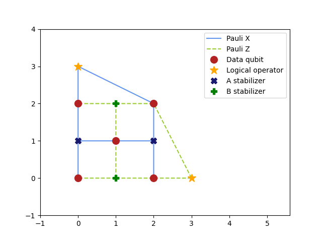

   The complete planar code of size 2

.. note:: ``code`` (a :class:`.LatticeCode`) from the first snippet in this
   page and ``code_l`` (a :class:`.CodeLattice`) are different types!

You can create a code by feeding it the lattice that defines it:

>>> custom_code = codes.LatticeCode(code_l, n_rounds=1)
>>> custom_code  # doctest: +ELLIPSIS
<plaquette.codes.LatticeCode object at ...>

This is now a fully-fledged :class:`.LatticeCode`, with all the functionality
that we have seen being true also for any of the pre-defined cases!

Creating a code from definitions of stabilizer generators
---------------------------------------------------------

A code can also be created directly from a definition of the stabilizer
generators and logical operators:

>>> from plaquette import pauli
>>> stabgens = [pauli.string_to_pauli("ZZ")]
>>> logical_ops = [pauli.string_to_pauli("XX"), pauli.string_to_pauli("IZ")]
>>> code = codes.LatticeCode.from_operators(stabgens, logical_ops, n_rounds=1)
>>> vis = visualizer.LatticeVisualizer(code)
>>> vis.draw_lattice_mpl()

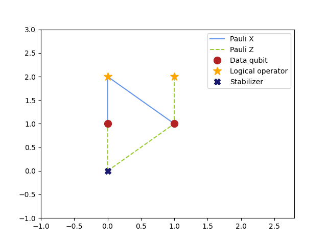

For very small systems, it is easier to create the code from a
definition of the stabilizer generators. If the system is larger, using
the lattice and lattice coordinates is usually a more convenient way to
specify the stabilizer generators. Also, when creating codes in this way, you
have no way to influence their placement in the "visual grid" (i.e. to give
coordinates to the vertices).

``stabgens`` and ``logical_ops`` do not contain any information of the
geometry of the surface code. Therefore, new linear positions are
assigned when creating the :class:`.LatticeCode`.

.. important:: While the visual representation of these codes might not be
   the most appealing, as far as simulations are concerned, there is no
   difference between the newly defined code (with 1D positions) and the old
   one (with 2D positions).

.. rubric:: Footnotes

.. [#] For the purposes of decoding, stabilizers are split into two
    or more groups based on commutation relations between stabilizer
    generators and potential errors as well as a-priori information on error
    probabilities. This splitting of stabilizers into groups *can* be the
    same as the splitting in the figure, but this is not necessarily the
    case.
