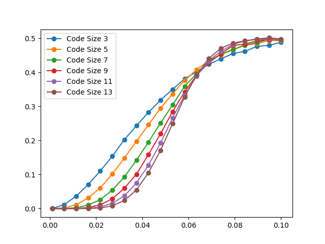
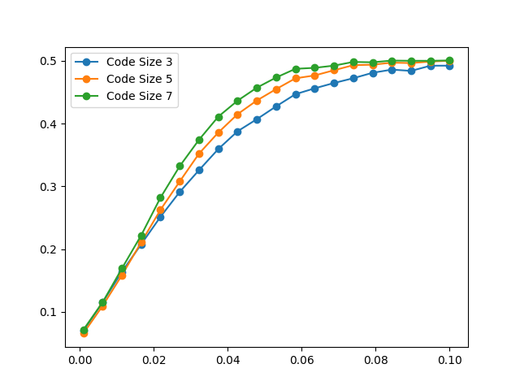
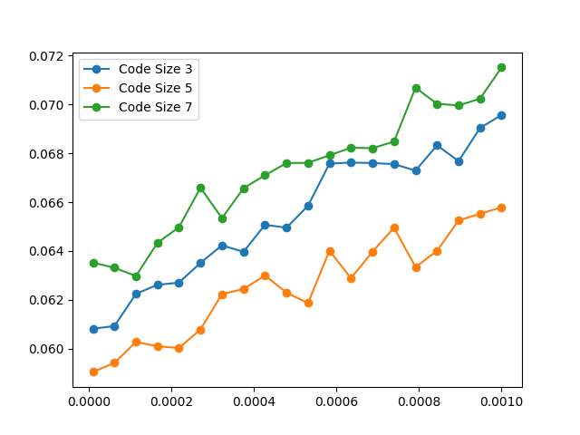
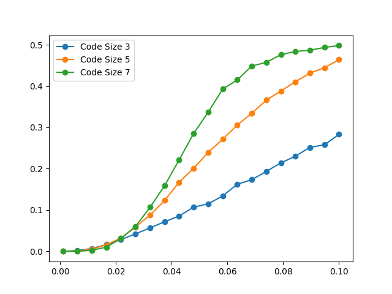
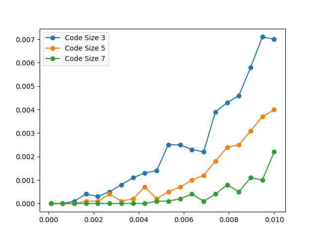
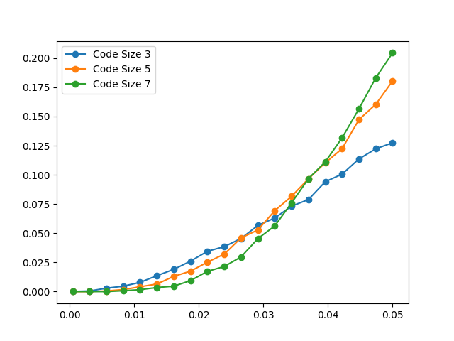

.. Copyright 2023, It'sQ GmbH and the plaquette contributors
   SPDX-License-Identifier: Apache-2.0

.. _declarative-guide:

A declarative approach to ``plaquette``
=======================================

.. sectionauthor:: Varun Seshadri

This tutorial will demonstrate how to use the :mod:`~plaquette.frontend` module of
:mod:`~plaquette` to run simulations through a set of configurations. For each
submodule in :mod:`~plaquette` the frontend contains a Config
:func:`~dataclasses.dataclass`, namely:

1. :class:`.CodeConfig` - Configuration metadata for the error
   correction code.
2. :class:`.ErrorsConfig` - Configuration metadata for the errors in
   the circuit.
3. :class:`.CircuitConfig` - Configuration metadata for making the circuit that
   will be simulated.
4. :class:`.DeviceConfig` - Configuration metadata for the simulator that will
   be used.
5. :class:`.DecoderConfig` - Configuration metadata for the decoder that will be
   used.

All the metadata can be provided using a toml file and this toml file
can be loaded using :meth:`~plaquette.frontend.ExperimentConfig.load_toml()`. See the
reference of frontend to get more details on how to fill this `toml` and how to
use the Config classes in general.

In the rest of this tutorial, we will be using the config file:
:download:`surface17_tutorial.toml` and we will
attempt to determine the thresholds under various situations for the
RotatedPlanarCode. The following situations are done here.

1. :math:`X,Z` Qubit Errors using the `Stim` backend and `PyMatchingDecoder` decoder
2. :math:`X,Z` Qubit Errors with gate errors for :math:`H, CZ, CX` using the
   `Stim` backend and `PyMatchingDecoder` decoder.
3. :math:`X,Z` Qubit Errors with measurement errors using the `Stim` backend and
   `PyMatchingDecoder` decoder.
4. :math:`X,Z` Qubit Errors with erasure errors using the `Stim` backend and
   `UnionFindDecoder`.

Over the course of this guide, we will demonstrate the ease of use in which
different errors can be toggled while running the simulations and the replicate
some results from the literature.

.. code-block:: python

   from plaquette.frontend import ExperimentConfig, _QubitErrorMetadata
   import numpy as np
   from pprint import pprint
   import matplotlib.pyplot as plt
   surf17_base_conf = ExperimentConfig.load_toml("docs/advanced/frontend/surface17_tutorial.toml")
   surf17_base_conf.build()

Once we have loaded the configurations onto the
:meth:`~plaquette.frontend.ExperimentConfig.load_toml` object,
we can instantiate the necessary object for running the
simulations using :meth:`~plaquette.frontend.ExperimentConfig.build`. Additional
methods exists to instantiate individual objects like
:meth:`.ExperimentConfig.build_code` and :meth:`.ExperimentConfig.build_errors()` etc.

Once we have instantiated, we can use :meth:`~plaquette.frontend.ExperimentConfig.run`
to get the value of the logical error rate for this particular configuration. In short,
if you already have a ``toml`` file, with the configurations, all you need to do is run
the following three lines to get a logical error rate.

.. code-block:: python
    :caption: Extracting a logical error rate from a toml config.

    conf = ExperimentConfig.load_toml(path_to_toml)
    conf.build()
    conf.run()

Experiment 1: X,Z Pauli Errors
----------------------------------

Simulate :math:`X`, :math:`Z` errors linearly growing between :math:`[0.001, 0.1]` for
code distances :math:`\{3,5,7\}`.

.. code-block:: python

    probs = np.linspace(1e-3, 1e-1, 20)
    code_sizes = [3, 5, 7]

    exp1_ler = list()
    for size in code_sizes:
        surf17_base_conf.code_conf.size = size
        log_err_rates_code = list()
        for prob in probs:
            print(size, prob)
            surf17_base_conf.errors_conf.qubit_errors.update(
                X= _QubitErrorMetadata(distribution="constant", params =[prob]),
                Z = _QubitErrorMetadata(distribution="constant", params =[prob])
            )
            surf17_base_conf.build()
            log_err_rates_code.append(surf17_base_conf.run())
        exp1_ler.append(log_err_rates_code)

    A threshold plot for experiment 1.

Experiment 2: X,Z Pauli Errors with gate errors
------------------------------------------------

Simulate :math:`X`, :math:`Z` errors like Experiment 1, but add gate errors for
:math:`H`, :math:`CZ` and :math:`CX`. The configuration is as below from the `toml`.

.. code-block:: toml

   [errors.gate_errors.CZ]
   induced_errors= ["XX", "ZI"]
   distribution = ["constant", "constant"]
   params =[[0.01], [0.0012]]

   [errors.gate_errors.CX]
   induced_errors=["ZZ", "XI"]
   distribution = ["constant", "constant"]
   params =[[0.01], [0.01]]

   [errors.gate_errors.H]
   induced_errors=["X", "Z"]
   distribution=["constant", "constant"]
   params = [[0.01], [0.01]]

This is read as follows; Whenever a :math:`CZ` gate is applied, it is followed
by the two qubit channels :math:`XX` and :math:`ZI` with a probability of 0.01
and 0.012 respectively. The order of the qubits is control followed by the
target. It follows analogously for the other two gates also. Initially in our
config, the flag for sampling gate errors was set to false, even though the
data is present in the config. We can enable the below code block. The
method :attr:`~plaquette.frontend.GateErrorsConfig.simulated_errors`
gives a structured version of the gate errors being simulated. Analogously, the
method :attr:`~plaquette.frontend.QubitErrorsConfig.simulated_errors` gives
the qubit errors being simulated, which will be something like
``({'H': [('constant', 'X', 0.01), ('constant', 'Z', 0.01)], ...)``. For more
details, see :ref:`errors-guide`.

.. code-block:: python

    exp2a_ler = list()
    for size in code_sizes:
        surf17_base_conf.code_conf.size = size
        log_err_rates_code = list()
        for prob in probs:
            print(size, prob)
            surf17_base_conf.errors_conf.qubit_errors.update(
                X=_QubitErrorMetadata(distribution="constant", params=[prob]),
                Z=_QubitErrorMetadata(distribution="constant", params=[prob])
            )
            surf17_base_conf.build()
            log_err_rates_code.append(surf17_base_conf.run())
        exp2a_ler.append(log_err_rates_code)

    A Threshold plot for experiment 2.

It looks like the curve is diverging from our initial data point of the
probability. So let’s rerun the simulation with ``1e-3`` being the
maximum probability.

.. code-block:: python

    probs = np.linspace(1e-5, 1e-3, 20)
    surf17_base_conf.errors_conf.gate_errors.sample = True
    exp2b = list()
    for size in code_sizes:
        surf17_base_conf.code_conf.size = size
        log_err_rates_code = list()
        for prob in probs:
            print(size, prob)
            surf17_base_conf.errors_conf.qubit_errors.update(
                X=_QubitErrorMetadata(distribution="constant", params=[prob]),
                Z=_QubitErrorMetadata(distribution="constant", params=[prob])
            )
            surf17_base_conf.build()
            log_err_rates_code.append(surf17_base_conf.run())
        exp2b.append(log_err_rates_code)

     Another Threshold plot for experiment 2.

Experiment 3: X and Z Pauli errors with measurement errors
----------------------------------------------------------

Simulate :math:`X`, :math:`Z` errors with measurement errors that also grows along
with the pauli errors. Since we don’t want to use gate errors, let’s switch it off and
switch on the measurement errors.

.. code-block:: python

    surf17_base_conf.errors_conf.gate_errors.sample = False
    probs = np.linspace(1e-3, 1e-1, 20)
    code_sizes = [3, 5, 7]
    surf17_base_conf.errors_conf.qubit_errors.measurement.enabled = True

.. code-block:: python

    exp3_ler = list()
    for size in code_sizes:
        surf17_base_conf.code_conf.size = size
        surf17_base_conf.code_conf.rounds = size -1
        log_err_rates_code = list()
        for prob in probs:
            print(size, prob)
            surf17_base_conf.errors_conf.qubit_errors.update(
                X=_QubitErrorMetadata(distribution="constant", params=[prob]),
                Z=_QubitErrorMetadata(distribution="constant", params=[prob]),
                measurement=_QubitErrorMetadata(distribution="constant", params=[prob])
            )
            surf17_base_conf.build()
            log_err_rates_code.append(surf17_base_conf.run())
            print(log_err_rates_code)
        exp3_ler.append(log_err_rates_code)

    A Threshold plot for experiment 3.

Clearly we are unable to find the thresholds because our probability
values are too high. When the measurement error rates grow in the same
rate as the Pauli rates, it looks like it kills the threshold. We are
re-running the simulation at one log unit lower.

.. code-block:: python

    probs = np.linspace(1e-4, 1e-2, 20)
    surf17_base_conf.errors_conf.qubit_errors.measurement.enabled = True
    exp3b_ler = list()
    for size in code_sizes:
        surf17_base_conf.code_conf.size = size
        surf17_base_conf.code_conf.rounds = size -1
        log_err_rates_code = list()
        for prob in probs:
            print(size, prob)
            surf17_base_conf.errors_conf.qubit_errors.update(
                X=_QubitErrorMetadata(distribution="constant", params=[prob]),
                Z=_QubitErrorMetadata(distribution="constant", params=[prob]),
                measurement=_QubitErrorMetadata(distribution="constant", params=[prob])
            )
            surf17_base_conf.build()
            log_err_rates_code.append(surf17_base_conf.run())
    exp3b_ler.append(log_err_rates_code)

    A Threshold plot for experiment 3.

Experiment 4 : X and Z Pauli errors with erasures
-------------------------------------------------

Simulate :math:`X`, :math:`Z` with erasure errors growing the pauli errors and changing
the decoder to ``UnionFindDecoder`` to accommodate the decoding with erasures. First,
we turn off the measurement errors from the previous experiment and turn on
the erasure for this experiment.

.. code-block:: python

    surf17_base_conf.errors_conf.qubit_errors.measurement.enabled = False
    surf17_base_conf.decoder_conf.name = "UnionFindDecoder"
    surf17_base_conf.decoder_conf.weighted = True
    probs = np.linspace(5e-4, 5e-2, 20)
    exp4_ler = list()
    for size in code_sizes:
        surf17_base_conf.code_conf.size = size
        surf17_base_conf.code_conf.rounds = size-1
        log_err_rates_code = list()
        for prob in probs:
            print(size, prob)
            surf17_base_conf.errors_conf.qubit_errors.update(
                X=_QubitErrorMetadata(distribution="constant", params=[prob]),
                Z=_QubitErrorMetadata(distribution="constant", params=[prob]),
                erasure=_QubitErrorMetadata(distribution="constant", params=[prob])
            )
            surf17_base_conf.build()
            log_err_rates_code.append(surf17_base_conf.run())
        exp4_ler.append(log_err_rates_code)

    A Threshold plot for experiment 4.
