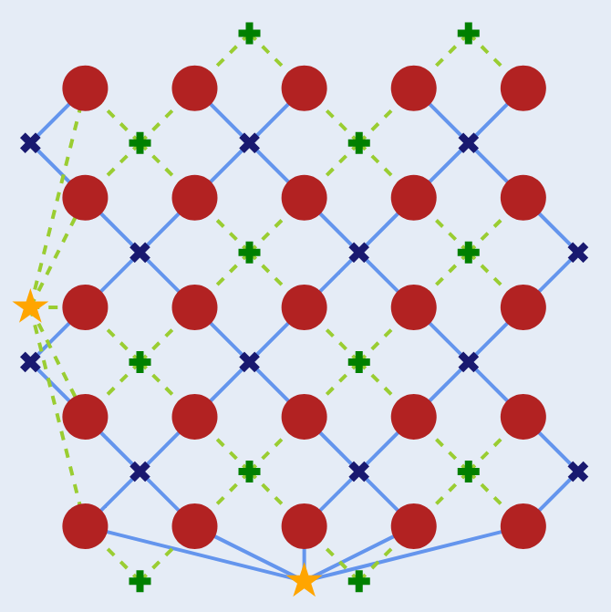

.. Copyright 2023, QC Design GmbH and the plaquette contributors
   SPDX-License-Identifier: Apache-2.0

``plaquette`` — an all-encompassing fault-tolerance software package
=====================================================================

``plaquette`` is a fully featured and easy-to-use library for studying quantum
error correction and fault tolerance. A few lines of code are enough to start
designing your first logical qubits, while detailed functionality allows for deeper
investigation of error correction codes, error models, and decoders.

The library features numerous quantum error correction codes (:term:`QECC`),
hardware-relevant error models and versatile decoders that can be used together
seamlessly. This library is tailored to  accommodate both newcomers and
experienced users alike.

Installation
------------

``plaquette`` can be installed like any other Python package via ``pip``.
Since ``plaquette`` is currently in alpha and is published on PyPI as such,
you need to add the ``--pre`` flag when installing via ``pip``::

    pip install plaquette

.. important::

   If you install other packages along with ``plaquette`` in one single
   command, the ``--pre`` flag will apply also to the other packages you list!

Otherwise, you can do::

    pip install git+https://github.com/qc-design/plaquette

which will install the latest development version. While we strive to keep this
as bug-free as possible, some rough corners are expected! Alternatively,
you can go to the `releases <https://github.com/qc-design/plaquette/releases>`_
section of the repository where you can find installable wheels (``.whl``
files) for stable versions of the software.

.. important::

   Being a pure-python package, installation does not require any particular
   software dependency that can't be found on PyPI, **but it does require
   having Python 3.10+!**.

If you're new to  ``plaquette``, we recommend starting with our :doc:`/quickstart`
guide, which  will introduce you to all aspects of the library and walk you through
a practical example, showcasing how the different components work together.

Feature highlights
------------------

``plaquette`` aims to be *fully* featured, meaning that our goal is to make
it possible to study quantum error correction and fault tolerance from start
to finish.

Customisable, flexible building blocks for error correction codes
   ``plaquette`` comes with a set of simple tools and primitives (like
   the :class:`.CodeLattice` and :class:`.StabilizerCode` classes) to help
   you start exploring your own ideas without having to re-invent the wheel
   all the time.
Rich set of "off-the-shelf" components
   While flexibility is important, we also provide pre-packaged solutions to
   speed things up and let you focus on what matters most to you. Want to
   study the surface code with varying types of errors and error rates?
   Just :meth:`~.LatticeCode.make_planar` without worrying about how to
   construct a lattice from scratch and define the errors you need!
Flexible device interfaces (even to *real quantum hardware*!)
   ``plaquette`` can be interfaced with different "devices"  (via
   :class:`.Device`), like a simple but open and easy to understand
   ``"clifford"`` backend, together with a streamlined :class:`.Circuit`
   description, which allows you to dive deep into the details of what's
   happening in the simulation. Want to manipulate and alter the internal
   :class:`.QuantumState` of the simulator before/after your circuit starts?
   You can! Don't care about that? Just :meth:`~.Device.get_sample`! Want to
   go to the next level and **run your circuits on a real quantum machine**?
   Check out the separate
   `IBM backend <https://docs.plaquette.design/projects/ibm-backend>`_, an interface
   to a real quantum machine! (wait times might be quite long, unfortunately)
Growing collection of fine-grained error models
   from simple Pauli error channels to correlated 2-qubit noise, gate-level
   errors and unique possibility of handling **erasure** errors, ``plaquette``
   allows you to fine-tune your simulated system to get as close as possible
   to what you really want to model. And you can do this on a
   *per-qubit basis*!
Fastest decoder implementation
   Our own implementation of the
   `UnionFind decoder <https://github.com/qc-design/plaquette-unionfind>`_
   has been optimized for incredible performance! Check out the
   `benchmarks <https://github.com/qc-design/plaquette-unionfind#benchmarks>`_ for
   a comparison with other known implementations of decoding algorithms.
Different types of classical decoding algorithms through third-party integrations
   We also provide interfaces to third-party decoders (like
   :class:`~.interfaces.PyMatchingDecoder` and
   :class:`~.interfaces.FusionBlossomDecoder`) for an easy comparison of
   multiple decoding strategies of a single quantum error correction code.

Maybe another important but often overlooked factor is that these features
benefit from being developed in lockstep with each other. This removes a lot
of the *glue code* that is usually necessary when interfacing many different
components that try to solve one specific aspect of quantum error correction.
With ``plaquette`` there is no need for glue code or changing data formats:
all is consistent and intuitive within the library (bugs excluded).

Overall structure
-----------------

``plaquette`` is organized into four primary areas:

:mod:`plaquette.pauli`
   Low-level, functional-style module that implements Pauli operations through the
   tableau formalism.
:mod:`plaquette.codes`
   Classes and methods dealing with the definition of error correction codes and
   lattices on which they are defined.
:mod:`plaquette.circuit` and :mod:`plaquette.device`
   Everything dealing with Clifford circuits and how to efficiently simulate
   them.
:mod:`plaquette.decoders`
   Performant classical decoding algorithms, either interfaces to existing
   3rd-party libraries or our own implementation.

Additionally, ``plaquette`` offers support for visualisation of quantum
error-correction codes and associated syndromes (:mod:`plaquette.visualizer`),
further enhancing the functionality and user experience of the library.

.. toctree::
   :caption: Usage guides
   :maxdepth: 2
   :hidden:

   quickstart
   advanced

.. toctree::
   :caption: Theory tutorials
   :maxdepth: 2
   :hidden:

   qec_tutorials/index

.. toctree::
   :caption: References
   :maxdepth: 1
   :hidden:

   API <apidoc/plaquette>
   ref/circuits
   ref/errordata
   ref/frontend
   references
   glossary

.. toctree::
   :maxdepth: 1
   :caption: Developer documents
   :hidden:

   dev/index
   dev/new_backend

Indices and tables
------------------

* :ref:`genindex`
* :ref:`glossary`
* :ref:`modindex`
* :ref:`search`

Supporters
----------

``plaquette`` is developed and maintained by `QC Design <https://www.qc.design/>`_.
``plaquette`` is also supported by the German Ministry of Education and Research
(BMBF) via project `PhotonQ <https://www.photonq.de/>`_. An early prototype of
``plaquette`` was developed under the support of the BMBF project
`PhoQuant <https://www.quantentechnologien.de/forschung/foerderung/quantencomputer-demonstrationsaufbauten/phoquant.html>`_.
