The decoding problem
====================

Previously, we learned how to define a quantum error correcting code by making use of
the stabilizer formalism. We also learned how one can use take non-destructive
measurements of the code's stabilizers to obtain a syndrome. We encouraged you to use
the simulation package ``plaquette`` to input many stances of errors and learn what
kind of syndrome should you expect given an error. A syndrome, as we also saw, is
degenerate, which means that many different errors can give the same syndromes.

Errors with the same shape as stabilizers and logical operators do not toggle any of
the stabilizer measurements. In the case of the former, the error is trivial because
applying a stabilizer to the state leaves it unchanged. The latter is not trivial and
posses a serious issue: a logical operator has been applied to the code, and we'll
never be able to detect it! All of our future calculations with that logical
qubit will return wrong results.

Quantum Error Correction doesn't only consist of encoding a few logical qubits into many
physical qubits and detecting errors on them, but it
also consists of obtaining a correction operator :math:`C`. This correction is also a
tensor product of Pauli operators on multiple qubits.

A correction :math:`C` for an error :math:`E` must fulfill the requirement that it
toggles the same stabilizer measurements.

.. math::

    C E \lvert \psi \rangle = C E g_i \lvert \psi \rangle = g_i (CE \lvert \psi \rangle) \quad \forall i

In this way, we can be sure that an error-afflicted state is once again a stabilized
state. Suppose that the error commutes with the :math:`i`-th stabilizer, then the
correction must also commute with that same stabilizer:

.. math::

    C E \lvert \psi \rangle = C E g_i \lvert \psi \rangle = C g_i E \lvert \psi \rangle = g_i (CE \lvert \psi \rangle)

Said, differently, if :math:`[g_i,E]=0` then it follows that :math:`[g_i,C]=0`.

And, if it anti-commutes with the :math:`j`-th stabilizer, the correction must also
anti-commute with that stabilizer:

.. math::

    C E \lvert \psi \rangle = C E g_j \lvert \psi \rangle = - C g_j E \lvert \psi \rangle = g_j (CE \lvert \psi \rangle)

Which means that if if :math:`\{g_i,E\}=0` then :math:`\{g_i,C\}=0`.

A correction :math:`C` to an error :math:`E` is considered to be successful if one
retrieves the original state of the system.

.. math::

    C\lvert \psi' \rangle = C E \lvert \psi \rangle  = \lvert \psi \rangle

Conversely, it is considered to have failed if the correction applied to the error
operator results in a logical error,

.. math::

    C\lvert \psi' \rangle = CE \lvert \psi \rangle = \bar{L} \lvert \psi \rangle,

for any logical operator :math:`\bar{L}` acting on the encoded qubit(s).

**Decoding** is the process through which one obtains a correction operator for a
specific syndrome in a code.

In the last tutorial we explored the action of errors on a code and observed what
syndrome was obtained. Now, we engage in the opposite process: we are given a syndrome
on the planar code of distance :math:`3` and we have to guess what type of error and on
which qubit the error occured.

First of all, we import the modules that we need from ``plaquette``.

>>> import plaquette
>>> import numpy as np
>>> from plaquette.codes import LatticeCode
>>> from plaquette.errors import QubitErrorsDict
>>> from plaquette.visualizer import LatticeVisualizer
>>> from plaquette.device import Device, MeasurementSample
>>> from plaquette.circuit.generator import generate_qec_circuit
>>> from plaquette import pauli
>>> planar_3 = LatticeCode.make_planar(size=3, n_rounds=1)
>>> vis = LatticeVisualizer(planar_3)
>>> vis.draw_lattice(height=300)  # doctest: +ELLIPSIS
Figure({...

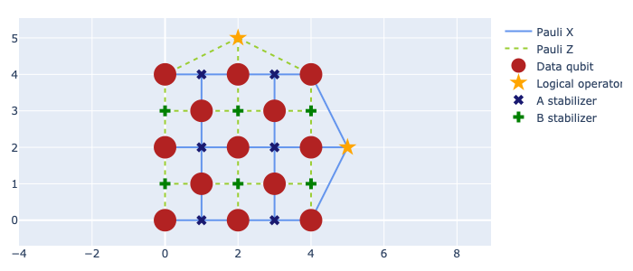

If we have a syndrome, we can use our understanding of how the stabilizer measurements
are toggled to make a guess about what correction operator will fulfill the previous
requirements and apply it to the code.

.. note::

    Operators in ``plaquette`` are represented through the tableau formalism, which
    will be introduced in future blog-posts. For now, it suffices to mention that we
    are creating the correction as a ``python`` ``dict`` (which is how we created the
    errors in the previous in the previous post), and we will transform them into
    the correct form by using a function from ``plaquette.pauli``.

Consider the syndrome shown below. We decide to define a correction operator consisting
of an :math:`X` operator on the qubit with index :math:`3`and a :math:`Z` operator on
the qubit with index :math:`7`.

>>> syndrome = np.array([1, 0, 0, 0, 1, 1, 0, 0, 0, 1, 0, 0])
>>> correction_dict = {3: "X", 7: "Z"}
>>> correction_operator = pauli.dict_to_pauli(correction_dict, planar_3.n_data_qubits)
>>> vis.draw_latticedata(height=300, syndrome=syndrome, correction = [correction_operator])  # doctest: +ELLIPSIS
Figure({...

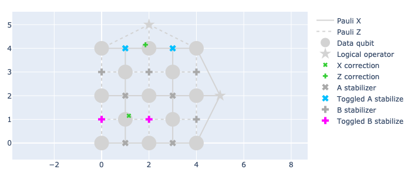

In the case of the following syndrome, we can choose any of the two following
corrections:

- :math:`X` on the qubits with indices :math:`6` and :math:`9`.
- :math:`X` on the qubits with indices :math:`8` and :math:`11`.

>>> syndrome = np.array([0, 0, 0, 0, 0, 1, 0, 0, 0, 0, 0, 1])
>>> correction_dict = {6: "X", 9: "X"}
>>> correction_operator = pauli.dict_to_pauli(correction_dict, planar_3.n_data_qubits)
>>> vis.draw_latticedata(height=300, syndrome=syndrome, correction = [correction_operator])  # doctest: +ELLIPSIS
Figure({...

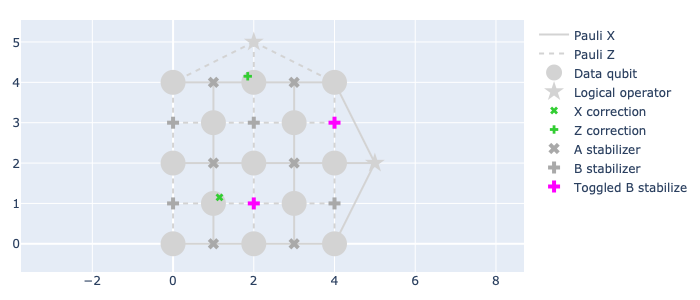

Comment: the above figure show X and Z correction, which is different from the corrections applied (X_6X_9) in the above code.

>>> syndrome = np.array([0, 0, 0, 0, 0, 1, 0, 0, 0, 0, 0, 1])
>>> correction_dict = {8: "X", 11: "X"}
>>> correction_operator = pauli.dict_to_pauli(correction_dict, planar_3.n_data_qubits)
>>> vis.draw_latticedata(height=300, syndrome=syndrome, correction = [correction_operator])  # doctest: +ELLIPSIS
Figure({...

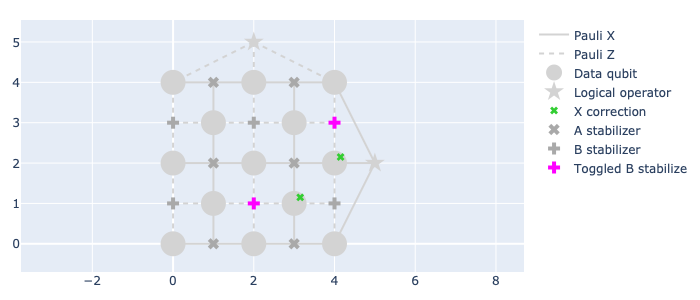

Both corrections commute with the same stabilizers and they both anti-commute with the
same stabilizers. Actually, you can see that both corrections are equivalent, given
that one of them is equal to the other times the product of the stabilizer
:math:`X_{6}X_{8}X_{9}X_{11}`.

We can begin to give a preliminary definition for what is the decoding problem: when
decoding, we are looking for a chain of qubits that connects any two syndromes and we
place errors of the same type between them. Because both our correction and *whatever*
the error was hold the same commutation/anti-commutation relations with every
stabilizer, the correction will return the state of the system to a stabilized state!

Now that we have set this *preliminary* definition, we can use it to start decoding
some other problems. Consider, for example, the following syndrome and two corrections
that we can choose:

>>> syndrome = np.array([0, 0, 1, 0, 0, 0, 0, 1, 0, 0, 0, 0])
>>> correction_dict = {0: "Z", 10: "Z"}
>>> correction_operator = pauli.dict_to_pauli(correction_dict, planar_3.n_data_qubits)
>>> vis.draw_latticedata(height=300, syndrome=syndrome, correction = [correction_operator])  # doctest: +ELLIPSIS
Figure({...

>>> syndrome = np.array([0, 0, 1, 0, 0, 0, 0, 1, 0, 0, 0, 0])
>>> correction_dict = {5: "Z"}
>>> correction_operator = pauli.dict_to_pauli(correction_dict, planar_3.n_data_qubits)
>>> vis.draw_latticedata(height=300, syndrome=syndrome, correction = [correction_operator])  # doctest: +ELLIPSIS
Figure({...

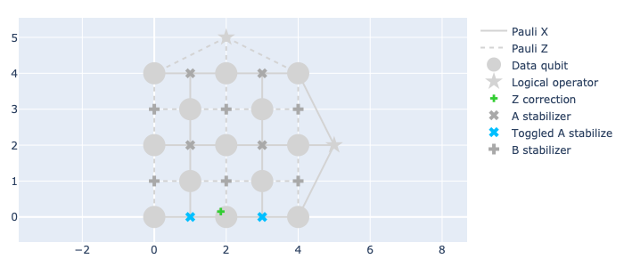

We just had a new syndrome for which we could apply (at least) two different
corrections, and both of the corrections reproduce the syndrome (they
commute/anti-commute with the same stabilizers)! So, given our last conclusion, we are
lead to believe that both corrections are the same. However, we have to ask ourselves,
are they really the same?

In the previous example, the corrections were equally valid because one
correction is equal to the product of the other correction times a stabilizer.
But this is not the case for our last example. Now, the former correction
(:math:`Z_0 Z_{10}`) is equal to the product of the latter times the logical
operator :math:`\bar{Z}`! This means that one correction rightfully corrects the
error, while the other one contributes to having a logical error.

What tools do we have that may help us make a decision between two or more *seemly
equally valid* corrections, in order to reduce the probabilities of choosing the one
that gives a logical error?

Consider a code where every error appears with probability :math:`p`. An error occurs
on that code and a syndrome is obtained through the stabilizer measurements. In our
efforts to correct it, we make two different assumptions as to what the error was:
either the error :math:`E'` or the error :math:`E''`. We can calculate the
probability of each of these two errors as:

.. math::

    p(E) = (1-p)^{1-N} p ^ N,

where :math:`N` is the number of single-qubit errors contained in the error :math:`E`.
For any value below :math:`p<0.5`, the probability of an error increases as the amount
of single-qubit errors decreases [Gimeno-Segovia, 2015]. This means that we are most
likely to avoid a logical error if we always choose a correction that matches the
error with less single-qubit errors. In our last example, this would be the correction
with a single :math:`X` on the qubit with index :math:`5`.

Because of this new insight, we might want to re-define the decoding problem as:
decoding consists of finding a correction operator :math:`C` such that it reproduces
the same syndrome as the error :math:`E` in a way that minimizes the probability of
obtaining a logical error. This can be done by creating sets of qubits and applying
single-qubit Pauli operators on them to connect the toggled stabilizer measurement
within the syndrome, and then choosing the set with the least amount of qubits.

A deeper look into logical errors
---------------------------------

We might want to make a small parenthesis now to talk about logical operators and
logical errors. In the past blog-post, we showed three different surface codes and
showed how the logical operators are defined. These definitions of the logical operators
may have seemed fixed to a specific set of single-qubit Pauli operators on the qubits.
Consider, for example, the logical :math:`\bar{Z}` on a planar code of distance
:math:`3`:

>>> correction_dict = {0: "Z", 5: "Z", 10: "Z"}
>>> correction_operator = pauli.dict_to_pauli(correction_dict, planar_3.n_data_qubits)
>>> vis.draw_latticedata(height=300, correction = [correction_operator])  # doctest: +ELLIPSIS
Figure({...

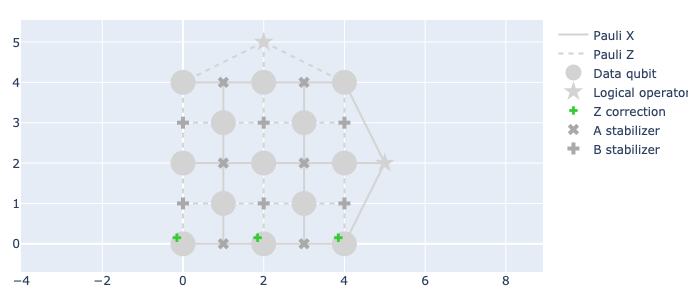

It seems as though the logical :math:`\bar{Z}` is given by applying :math:`Z` operators
along a straight horizontal line at the bottom qubits of the code. However, if we
multiply this operator times the stabilizer :math:`Z_{8}Z_{10}Z_{11}`, we are still
applying the same logical operator on the code, but the shape of the chain of operators
seems a little bit different:

>>> correction_dict = {0: "Z", 5: "Z", 8: "Z", 11: "Z"}
>>> correction_operator = pauli.dict_to_pauli(correction_dict, planar_3.n_data_qubits)
>>> vis.draw_latticedata(height=300, correction = [correction_operator])  # doctest: +ELLIPSIS
Figure({...

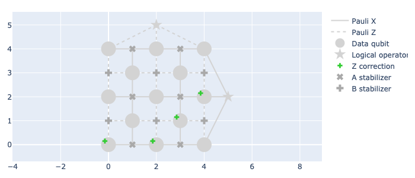

This is also a logical operator, and its effect is the same as the logical operator shown
before. This means that a logical error is not necessarily restricted to the shape of
the straight lines, but it can take many different paths along the code.

The decoding graph
==================

A graph is a mathematical abstract object consisting of two types of elements: vertices
(or nodes) and edges. Vertices can be imagined as points in an abstract space, and an
edge is a line connecting two vertices. The edges in a graph allow us to find relations
between different vertices in the graph.

This last definition of the decoding problem can be redefined as a problem in graph
theory. We have an underlying graph that represents the structure of the
error-correcting code. In this graph, the vertices represent the ancillas used for
measurements. In some specific scenarios, as we will later see, additional vertices
should be added. An edge in the decoding graph represents the action of a single-qubit
Pauli error on a given qubit, and the vertices connected by this edge are the
stabilizer measurements that would be toggled in case that this error takes place.

The toggled stabilizers, that is, the elements with a value of :math:`1` in the
syndrome, are identified in the graph as *syndrome vertices*, and the decoding problem
is transformed to: find a combination of edges that connects pairs of syndrome vertices
in such a way that the number of edges is minimized.

Take, for example, the planar code of distance :math:`3`. This planar code has
:math:`12` measurement ancillas, which means that the graph is composed by 12 vertices.
Each vertex is identified by giving it an index which indicates the ancilla it
represents. The planar code has :math:`13` data-qubits, and two different types of
errors can act on each of the qubits (see note below). Thus, there are :math:`26`
edges, :math:`13` for the :math:`X` errors and :math:`13` for the :math:`Z` errors.

>>> syndrome = np.array([1, 1, 1, 1, 1, 1, 1, 1, 1, 1, 1, 1])  # little hack to "highlight" the syndrome nodes/vertices
>>> vis.draw_latticedata(height=300, syndrome=syndrome)  # doctest: +ELLIPSIS
Figure({...

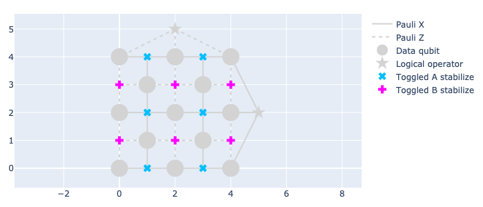

.. note::

    Actually there are 3 errors, if we take the :math:`Y` Pauli operator into account;
    but this last operator can be separated into a :math:`X` and a :math:`Z`. Hence, an
    error of the :math:`Y`-type is represented by the simultaneous action of both edges.

In the planar code, we notice that the :math:`X` errors toggle the following stabilizer
measurements:

- :math:`X_0`: toggles the :math:`0`-th ancilla.
- :math:`X_1`: toggles the :math:`0`-th and :math:`1`-st ancillas.
- :math:`X_2`: toggles the :math:`1`-th ancilla.
- :math:`X_3`: toggles the :math:`0`-th and :math:`5`-th ancillas.
- :math:`X_4`: toggles the :math:`1`-st and :math:`6`-th ancillas.
- :math:`X_5`: toggles the :math:`5`-th ancilla.
- :math:`X_6`: toggles the :math:`5`-th and :math:`6`-th ancillas.
- :math:`X_7`: toggles the :math:`6`-th ancilla.
- :math:`X_8`: toggles the :math:`5`-th and :math:`10`-th ancillas.
- :math:`X_9`: toggles the :math:`6`-th and :math:`11`-th ancillas.
- :math:`X_10`: toggles the :math:`10`-th ancilla.
- :math:`X_11`: toggles the :math:`10`-th and :math:`11`-th ancillas.
- :math:`X_12`: toggles the :math:`11`-th ancilla.

In the case of the :math:`Z` errors:

- :math:`Z_0`: toggles the :math:`2`-nd ancilla.
- :math:`Z_1`: toggles the :math:`3`-rd ancilla.
- :math:`Z_2`: toggles the :math:`4`-th ancilla.
- :math:`Z_3`: toggles the :math:`2`-nd and :math:`3`-rd ancillas.
- :math:`Z_4`: toggles the :math:`3`-rd and :math:`4`-th ancillas.
- :math:`Z_5`: toggles the :math:`2`-nd and :math:`7`-th ancillas.
- :math:`Z_6`: toggles the :math:`3`-rd and :math:`8`-th ancillas.
- :math:`Z_7`: toggles the :math:`4`-th and :math:`9`-th ancillas.
- :math:`Z_8`: toggles the :math:`7`-th and :math:`8`-th ancillas.
- :math:`Z_9`: toggles the :math:`8`-th and :math:`9`-th ancillas.
- :math:`Z_10`: toggles the :math:`7`-th ancilla.
- :math:`Z_11`: toggles the :math:`8`-th ancilla.
- :math:`Z_12`: toggles the :math:`9`-th ancilla.

In the following example we have four syndrome vertices which are the ones with
indices: :math:`2`, :math:`7`, :math:`10`, :math:`11`. From our list of edges, we
notice that we have the following two edges: :math:`(2, 7)` and :math:`(10, 11)`. So,
we choose these two edges as our correction. We can now take a look at our look-up
table of edges and see that they represent the operators :math:`Z_5` and :math:`X_11`,
which is our correction.

>>> syndrome = np.array([0, 0, 1, 0, 0, 0, 0, 1, 0, 0, 1, 1])
>>> vis.draw_latticedata(height=300, syndrome=syndrome)  # doctest: +ELLIPSIS
Figure({...

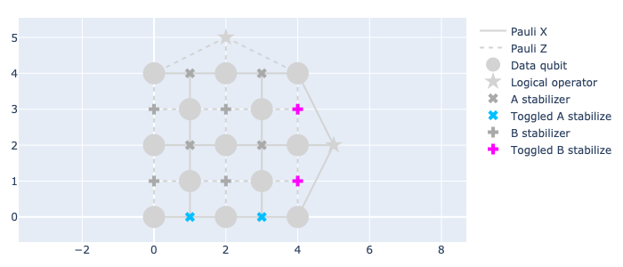

In this other example, we have one pair of syndrome vertices: :math:`2` and :math:`8`.
There is no edge that connects these two vertices together. However, we can follow a
path of *connected edges* (i.e., edges that share one vertex) to *walk* from one vertex
to the other. We choose the edges :math:`(2, 3)` and :math:`(3, 8)`. Then, we say that
our correction is given by the Pauli operators :math:`Z_3` and :math:`Z_6`.

We could have also chosen the edges :math:`(2, 7)` and :math:`(7, 8)`, which give the
correction :math:`Z_5Z_8`.

>>> syndrome = np.array([0, 0, 1, 0, 0, 0, 0, 0, 1, 0, 0, 0])
>>> vis.draw_latticedata(height=300, syndrome=syndrome)  # doctest: +ELLIPSIS
Figure({...

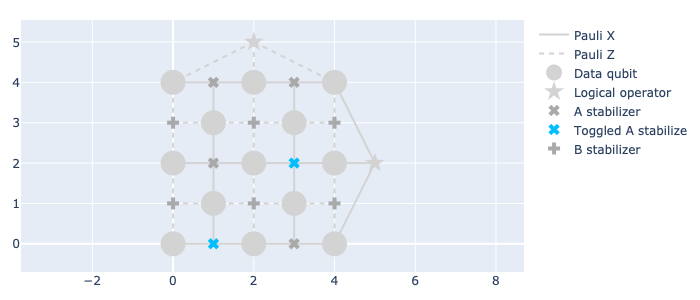

Comment: Can add here the following sentence:

Here another possible correction is by the Pauli operators Z_0 and Z_11. To describe this correction in terms of the decoding graphs, we can add a virtual vertex to the decoding graph. You may have also noticed that we can have some single-qubit errors that only toggle...

You may have noticed that here we have some single-qubit errors that only toggle one
ancilla. We call these edges *dangling* edges, and we can add a new *virtual* vertex,
which we can call an *open vertex*, and give it an index higher than the total amount
of ancillas. By doing this, we can easily keep track of which one is the open vertex.
The edge of the errors that toggle a single ancilla connect the vertex of the ancilla
with the open vertex. In the case of the planar code of distance :math:`3`, this vertex
would have the index :math:`12`.

We can say that open vertices are *wild cards*. And we can treat them as syndrome
vertices or not, depending on what is more convenient for us.

Take a look at the following syndrome. Here, we only have a single syndrome vertex, and
we can't pair it with any other syndrome vertex. In this case, we can use the open
vertex as the second open vertex with which we make the pairing. Hence, the edge that
we choose is :math:`(3, 12)`. This edge represents an error toggling only the third
vertex, :math:`Z_1`.

>>> syndrome = np.array([0, 0, 0, 1, 0, 0, 0, 0, 0, 0, 0, 0])
>>> vis.draw_latticedata(height=300, syndrome=syndrome)  # doctest: +ELLIPSIS
Figure({...

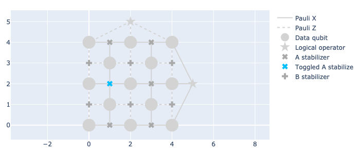

.. note::

   Dangling edges currently do not appear in the visualizer.

The open vertex can be paired with as many syndrome vertices as necessary. In one of
the previous examples (shown below) we could have also chosen the combination of
dangling edges: :math:`(2, 12)` and :math:`(8, 12)`, by pairing each syndrome vertex
with the open vertex. The correction is given by :math:`Z_0Z_{11}`.

>>> syndrome = np.array([0, 0, 1, 0, 0, 0, 0, 0, 1, 0, 0, 0])
>>> vis.draw_latticedata(height=300, syndrome=syndrome)  # doctest: +ELLIPSIS
Figure({...

The weighted decoding graph
---------------------------

In a more realistic scenario, we can't expect that all qubits have the same error
probabilities. Each qubit will have a different probability influenced by its
environment, the way in which operators are applied on them, their interactions with other
qubits, etc. If we have a deep knowledge about the device we are working on, then we
can use this information to increase our chances of applying the right corrections on
the code.

Consider a code where each type of error on each qubit has a different error
probability. We use the quantity :math:`p_i` to represent the probability of the error
represented by the :math:`i`-th edge. An error :math:`E` can be described by an array
of boolean variables, where the :math:`i`-th position indicates if the edge is or isn't
in the error (we use :math:`E_i=0` to say that the edge is not in the error, and
:math:`E_i=1` to say that the edge is in the error). We can then compute the
probability of the error chain [Dennis, 2002]:

.. math::

    p(E) = \prod_i (1-p_i) ^{1 - E_i} p_i ^ {E_i} = \prod_i \left(\frac{p_i}{1-p_i}\right) ^{E_i} (1-p_i)

We can take the negative logarithm of this quantity:

.. math::

    -\ln{p(E)} = \sum_i E_i \left(-\ln\left(\frac{p_i}{1-p_i}\right)\right) + \sum_i \left(-\ln(1-p_i)\right)

We notice that the last sum at the end of the right hand side   of the previous equation does not
depend on the shape of the error, i.e., does not depend on :math:`E_i`, so we can
ignore it. We call the quantity being added,
:math:`w_i = -\ln\left(\frac{p_i}{1-p_i}\right)`, the weight of the :math:`i`-th edge.

The edge-weights are an additive quantity that tell us how likely is an error to occur.
The lower the weight-sum, the higher the probability of an error. We can construct
errors by adding edge by edge and compute its likelihood easily by adding the weight of
the new edge.

Decoding algorithms
===================

Actually performing the decoding is the last and hardest step when protecting the information of a code. This
process must be done quickly, faster than the emergence of new errors. It would be
pointless to correct one error if, during the time required to do so, ten new errors
appeared. Because of this, we need to automate this process. Because of this, a few
decoding algorithms have been proposed.

Comment: Because of this repeats here. Instead can write something like: 

Because of this, we need to automate this process. A few decoding algorithms have been proposed to automate this process.

The decoding algorithms are, as their name suggests, algorithms that take as input the
graph (or weighted graph) of the underlying structure of a code and a syndrome and give
as output a selection of edges, i.e., a correction operator. These decoding algorithms
should have, in a worst case scenario, a runtime that scales polynomially with the size
of the code. The first decoder to achieve this is the Minimum Weight Perfect Matching.

The Minimum Weight Perfect Matching
-----------------------------------

This algorithm consists of calling the following two algorithms [Higgot, 2021]:

- Dijkstra's algorithm [Dijkstra, 1959]: here, one computes the shortest path between
  each pair of syndrome vertices and the path between each syndrome vertex and the open
  vertex. The distance of each path is stored in a matrix, and the path is also stored.
  When the graph does not contain weights, the distance between each pair is given by the
  Manhattan distance between the two vertices (i.e., the sum of the absolute difference
  between each of the coordinates of the ancillas supporting the vertices in the code's
  lattice). When the graph is weighted, then the distance is given by the sum of the
  weights of the edges in the path.

- Kolmogorov's Blossom V algorithm [Kolmogorov, 2009]: here, every combination of pairs
  of syndrome vertices is created and the sum of the distances between each pair of the
  vertices per combination is obtained. In the end, the algorithm chooses the combination
  that has the smallest sum.

Once that the combination with the smallest distance-sum has been obtained, the
algorithm obtains the edges making up the paths in that combination and returns it as
the correction.

This algorithm manages to find a correction with a runtime that scales polynomially
with the number of qubits in the code, with a complexity of
:math:`\mathcal{O}(n^3 \ln{(n)})`. Among the decoders that run in polynomial time, the
MWPM is the one with the highest decoding accuracy, i.e., the one that obtains logical
errors less often.

We can use ``plaquette`` and its integration with ``PyMatching``'s
implementation of the MWPM.

>>> from plaquette.decoders import PyMatchingDecoder

We can now use the decoder to obtain the correction for a syndrome in a surface code.
We will now simulate a distance :math:`5` planar code to show corrections for more
complicated errors on an unweighted graph. Here, we will give each qubit a probability
of :math:`0.04` for :math:`X`, for :math:`Y` and for :math:`Z` errors. In these
examples (plural, because you can run the code-block multiple times and get a new,
random error any time), you can visualize the syndrome and the correction.

We are making use of the function ``get_sample_random``, which is very similar to
``get_syndrome_random`` from the past tutorial, but now we are receiving the whole
sample, which also includes a list of the erased qubits (for our current conditions,
none are erased, but the decoder needs this information).

>>> def get_sample_random(code, qed, logical_ops="X"):
...     circuit = generate_qec_circuit(code, qed, {}, logical_ops)
...     dev = Device("clifford")
...     dev.run(circuit)
...     raw_results, erasure = dev.get_sample()
...     sample = MeasurementSample.from_code_and_raw_results(code, raw_results, erasure)
...     return sample

>>> planar_5 = LatticeCode.make_planar(size=5, n_rounds=1)
>>> p = 0.04
>>> qed: QubitErrorsDict = {
...     "pauli": {i: dict(x=p, y=p, z=p) for i in range(planar_5.n_data_qubits)}
... }
>>> sample = get_sample_random(planar_5, qed)
>>> mwpm = PyMatchingDecoder.from_code(planar_5, qed, weighted=False)
>>> correction = [mwpm.decode(sample.erased_qubits, sample.syndrome)]
>>> vis_5 = LatticeVisualizer(planar_5)
>>> vis_5.draw_latticedata(height=500, syndrome=sample.syndrome[0], correction=correction)  # doctest: +ELLIPSIS
Figure({...

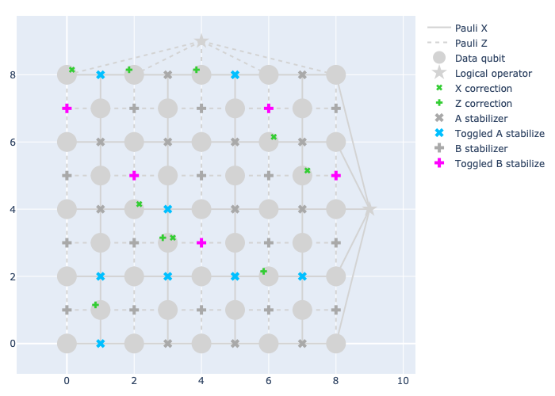

We can also use ``plaquette`` to use the weighted variant of the MWPM. For this, we
decide to give each qubit a random error probability between :math:`0` and :math:`0.1`.

We can also use ``plaquette`` to plot a heat map of the error probability for :math:`X`
errors and for :math:`Z` errors, as shown in the following blocks of code.

.. note::

    The effective :math:`X` error probability on a qubit is equal to the probability of
    having an :math:`X` error plus the probability of having a :math:`Y` error on that
    same qubit. Likewise, the effective :math:`Z` error probability on a qubit is the
    sum of the :math:`Z` error probability plus the :math:`Y` error probability. We
    define a calculator ``get_effective_probabilities`` to handle these quantities.

>>> def get_effective_probabilities(code, qed):
...     x_prob = np.zeros(code.n_data_qubits)
...     z_prob = np.zeros(code.n_data_qubits)
...     pauli_probs = qed.get("pauli", {})
...     for qubit in pauli_probs.keys():
...         x_prob[qubit] += pauli_probs.get(qubit, {}).get("x", 0)
...         x_prob[qubit] += pauli_probs.get(qubit, {}).get("y", 0)
...         z_prob[qubit] += pauli_probs.get(qubit, {}).get("z", 0)
...         z_prob[qubit] += pauli_probs.get(qubit, {}).get("y", 0)
...     return x_prob, z_prob

Now, we generate the random probability distribution, calculate the effective
probabilities and create a visualizer that will allow us to see the probability
distributions of each type of error.

>>> rnd = np.random.default_rng(seed=1234)
>>> error_probabilities = rnd.uniform(0, 0.1, (planar_5.n_data_qubits, 3))
>>> random_qed: QubitErrorsDict = {
...     "pauli": {i: dict(x=error_probabilities[i, 0],
...                       y=error_probabilities[i, 1],
...                       z=error_probabilities[i, 2]) for i in range(planar_5.n_data_qubits)}
... }
>>> x_prob, z_prob = get_effective_probabilities(planar_5, random_qed)
>>> vis_5x = LatticeVisualizer(planar_5, qubit_error_probs=x_prob)
>>> vis_5z = LatticeVisualizer(planar_5, qubit_error_probs=z_prob)

We visualize the effective :math:`X` error probability distribution:

>>> vis_5x.draw_lattice(height=300)  # doctest: +ELLIPSIS
Figure({...

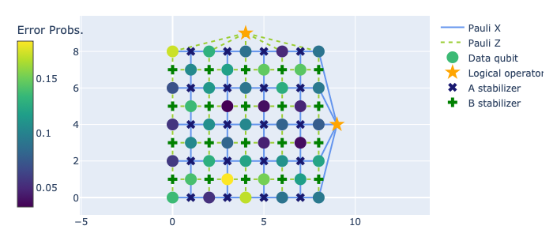

We visualize the effective :math:`Z` error probability distribution:

>>> vis_5z.draw_lattice(height=300)  # doctest: +ELLIPSIS
Figure({...

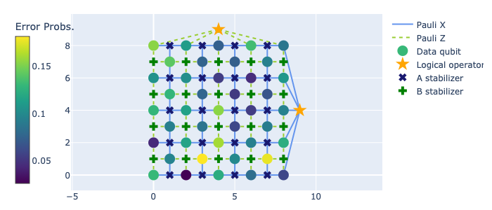

And now, we can run multiple times the following code block to obtain a random syndrome
sample and the correction given by the MWPM decoder.

>>> sample = get_sample_random(planar_5, random_qed)
>>> mwpm = PyMatchingDecoder.from_code(planar_5, random_qed, weighted=True)
>>> correction = [mwpm.decode(sample.erased_qubits, sample.syndrome)]
>>> vis_5 = LatticeVisualizer(planar_5)
>>> vis_5.draw_latticedata(height=500, syndrome=sample.syndrome[0], correction=correction)  # doctest: +ELLIPSIS
Figure({...

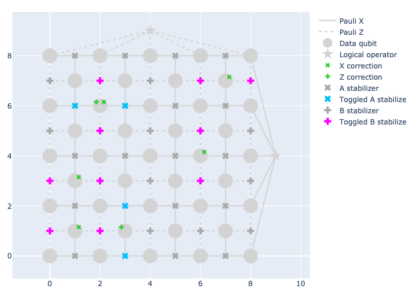

Union Find
----------

Following from the argument that decoding has to be done quickly so that we can keep up
with the emergence of new errors, the Union Find is a new decoder that has been
recently proposed, and it is able to find a correction in almost-linear time!

This algorithm consists of two sub-algorithms:

- The Maximum Likelihood decoder for erasures (also known as "peeling decoder"). This is
  an algorithm that corrects for a specific type of error: the erasure. An erasure is an
  error where a qubit has been physically lost or where the information of the qubit has
  been erased. An erasure is well-located within the code. Whenever a qubit is erased, we
  know with full certainty which one it is. The qubit is then replaced by *or reinitialised
  as a qubit in a completely mixed state, i.e., the state of this qubit is in the
  correct state with probability of :math:`25\%` or it will have an :math:`X`, :math:`Y`
  or :math:`Z` error, each with a probability of :math:`25\%` [Delfosse, 2020].

  Whenever we have an erasure (i.e., a set of erased qubits), we can create a sub-set
  :math:`\mathcal{R}` of the edges supported by these qubits in the graph. We can do
  this because the location of the erased qubits is well-known! We also perform our
  stabilizer measurements to obtain the syndrome of a given error.

  The peeling decoder works as follows: first, the erasure is identified on the
  decoding graph as a subset of edges. Second, we remove edges from the erasure in
  such a way that the erasure sub-graph contains no loops (a path of edges that
  returns to a previously visited vertex). This loop-less graph, called a *forest*,
  should contain as many edges from the original erasure as possible. This process
  can be done by choosing a seed (if the code has an open boundary, then the open
  vertices are first chosen as seeds), and *walking* through the erasure by adding
  edges if only one of its vertices is already in the forest. If both vertices are
  already in the forest, the edge is discarded. If a connected sub-graph is not
  connected to an open vertex, we can choose randomly any of its vertices as the
  seed. The figure below shows how the forest is created in a graph of a planar code
  of distance :math:`4` (we are only showing the edges that represent :math:`Z`
  errors for simplicity):

  .. image:: forest.png
     :width: 300px

  Finally, the forest is peeled from its *leaves*. We call a *leaf* an edge that is
  connected to the rest of the erasure through only one of its vertices, while the
  other vertex, which we call *pendant vertex* is disconnected from the erasure.

  When removing a leaf, if the pendant vertex **is not** a syndrome vertex, then we
  continue and remove another leaf. If the pendant vertex **is** also a syndrome
  vertex, then the edge is added to the correction operator. Then, the state of the
  non-pendant vertex of the leaf is flipped: if the non-pendant vertex was a syndrome
  vertex, then it will no longer be a syndrome vertex; if the non-pendant vertex
  wasn't a syndrome vertex, it will now become a syndrome vertex. Below you can find
  an example of how the peeling is performed, and how the correction is obtained.

  .. image:: peeling.png
     :width: 300px

  This decoding algorithm works only for erasures. The extra information regarding
  the location of the erasures is what gives this algorithm a linear complexity. One
  of the decoder's requirements is that every connected subgraph within the erasure
  must have an even number of syndrome vertices **or** it must be connected to an
  open vertex.

- Syndrome validation [Delfosse, 2021]. As we claimed, the peeling decoder works only
  with erasures, because it requires a subgraph within the code's decoding graph
  containing the edges that correspond to erased qubits. The peeling decoder cannot be
  used to correct for Pauli errors, because the only information that can be retrieved
  from these errors is the syndrome. We are missing the erasure. Because of this, the
  syndrome validation takes as input a pre-processed erasure (which can be empty) and a
  syndrome and attempts to create a *virtual* erasure that fulfills the requirements set
  by the peeling decoder: to have an erasure, and that each connected subgraph within the
  erasure must have an even number of syndrome vertices or be connected to an open vertex.

  The syndrome validation works as follows: it first identifies within the graph the
  real erasure (again, might be empty) as a subset of edges, and the syndrome
  vertices within the syndrome graph. Then, it identifies *clusters*. A cluster is a
  connected sub-graph within the erasure. A cluster can be as small as a single
  vertex (which, in this case, would be a single syndrome vertex). Then, one creates
  a *growth list*. Here, one identifies every cluster with an *odd parity*, where we
  use the term odd parity to refer to clusters that have an odd number of syndrome
  vertices **and** are **not** connected to an open vertex. Then, each one of the
  clusters in this list grows (or *spreads*) towards every edge from the decoding
  graph that is connected to itself. At a single growth step of a cluster, every edge
  grows only by half.

  Whenever an edge with vertices :math:`\{u, v\}` is fully grown, we call a function
  ``Find`` on both vertices. This function tells us to which cluster do these vertices
  belong to. If:

  * ``Find(u)`` or ``Find(v)`` returns nothing, then :math:`u` (or :math:`v`) is not yet
    contained in any cluster, and then it is added to the cluster from which the growth
    was performed.

  * ``Find(u) == Find(v)``, then both of the vertices belong to the same cluster.

  * ``Find(u) != Find(v)``, these two vertices belong to different clusters. In this
    case, we call a function ``Union(u, v)`` and these two clusters are merged into one.
    Preferably, the smaller cluster is merged into the bigger one. The new cluster
    (result of merging the two of them) may be removed from the growth list if it no
    longer has an odd parity.

  This process of growth, call of ``Find``, call of ``Union``, is repeated until all
  clusters have an *even parity*. At this point, we can say that the syndrome
  validation is completed. Below you can find an example of a syndrome validation on
  a code with an initial erasure and syndrome vertices. By the end, we have a new
  erasure and the same syndrome.

  .. image:: syndrome-validation.png
     :width: 300px

  The complexity of this algorithm is almost-linear, namely,
  :math:`\mathcal{O}(n\alpha(n))`, where :math:`\alpha(n)` is the inverse of
  Ackerman's function, and its value is smaller or equal than :math:`3` for any
  practical value of :math:`n`.

The Union Find decoder is the algorithm that takes as input an erasure and a syndrome,
then it processes them through the syndrome validation to obtain a new, virtual
erasure, and then calls the peeling decoder by giving as input the virtual erasure and
the syndrome to obtain a selection of edges as the correction.

Naturally, the Union Find decoder is included in the library ``plaquette``.

>>> from plaquette.decoders import UnionFindDecoder

.. note::

   This decoder is Python-based. For a much more performant option, have a look
   at `its C++ version <https://github.com/qc-design/plaquette-unionfind>`_.

We will now use the Union Find to decode some samples. We will use the same code and
error probabilities as we did for the MWPM.

>>> sample = get_sample_random(planar_5, qed)
>>> uf = UnionFindDecoder.from_code(planar_5, qed, weighted=False)
>>> correction = [uf.decode(sample.erased_qubits, sample.syndrome)]
>>> vis_5 = LatticeVisualizer(planar_5)
>>> vis_5.draw_latticedata(height=500, syndrome=sample.syndrome[0], correction=correction)  # doctest: +ELLIPSIS
Figure({...

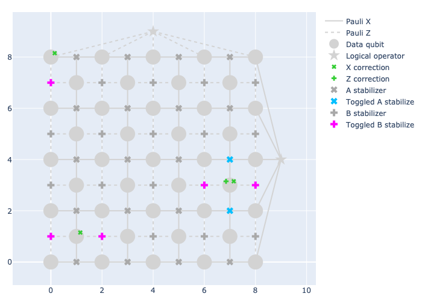

The Union Find can also make use of the weights on a decoding graph to increase its
accuracy when decoding errors on a code where the error probabilities are not equal
everywhere. A weighted Union Find, as proposed in [Huang, 2021]. Here, they propose to
add a small modification to the algorithm, specifically in the way in which edges are
grown.

As mentioned previously, the original (unweighted) Union Find grows, at each growth
step, every vertex connected to the growing-cluster by a measure of a half-edge. In
order to make the edges grow based on their weights, we will first find , amongst the
edges to-be-grown, the one with the smallest weight, and assign its weight to a
variable :math:`w_{min}`. Then, we will complete the growth of every other edge that
shares the same weight as :math:`w_{min}`. Then, the weight of every other edge will be
updated, following:

.. math::

    w_i \gets w_i - w_{min}

We can use ``plaquette`` to decode a code by using weights. We will be using the same
error distribution as the one we obtained for the MWPM.

>>> sample = get_sample_random(planar_5, random_qed)
>>> weighted_uf = UnionFindDecoder.from_code(planar_5, random_qed, weighted=True)
>>> correction = [weighted_uf.decode(sample.erased_qubits, sample.syndrome)]
>>> vis_5 = LatticeVisualizer(planar_5)
>>> vis_5.draw_latticedata(height=500, syndrome=sample.syndrome[0], correction=correction)  # doctest: +ELLIPSIS
Figure({...

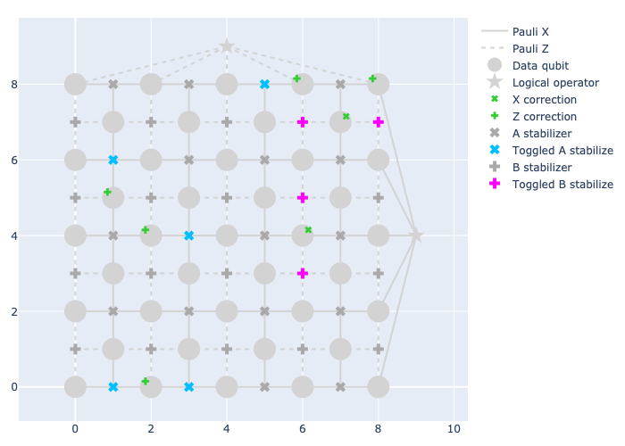

Logical error rate
------------------

One way of determining the decoding accuracy of a decoder is to obtain a *logical error
rate*. As its name suggests, this is the rate with which we obtain logical errors. The
logical error can vary depending on:

- The code.
- The distance of the code.
- The decoding algorithm.
- Whether or not we are using weights.

We can obtain the logical error rate through Monte Carlo simulations, i.e., we choose a
number of samples that we want to run, we obtain a correction per each sample, we
compare the correction with the error (which is something we can do *in simulations*)
to determine if we obtained a logical error, and we count the number of logical errors
encountered and divide it by the number of samples. We want this number of samples to
be big enough so that it is statistically relevant.

We can use the function :func:`.check_success` from ``plaquette.decoders.decoderbase``
to see whether a correction was successful or not.

>>> from plaquette.decoders.decoderbase import check_success

Let's compare the two algorithms, both weighted and unweighted, under the same
conditions to see which one has the smallest logical error rate (ergo, the hightest
accuracy), and to be made sure that using weights actually improves their accuracy!

We will use a planar code of distance 5 and the following non-equal probability
distribution that we used to test the weighted MWPM and the weighted Union Find to
obtain the logical error rates. Make sure to change the code, the distance of the code
and the error probabilities to see how their performance changes!

.. code-block:: python

    planar_5 = LatticeCode.make_planar(size=5, n_rounds=1)
    plaquette.rnd = np.random.default_rng(seed=1234)  # ensures repeatability of the following results
    error_probabilities = plaquette.rnd.uniform(0, 0.1, (planar_5.n_data_qubits, 3))
    random_qed: QubitErrorsDict = {
        "pauli": {i: dict(x=error_probabilities[i, 0],
                          y=error_probabilities[i, 1],
                          z=error_probabilities[i, 2]) for i in range(planar_5.n_data_qubits)}
    }
    mwpm = PyMatchingDecoder.from_code(planar_5, random_qed, weighted=False)
    weighted_mwpm = PyMatchingDecoder.from_code(planar_5, random_qed, weighted=True)
    uf = UnionFindDecoder.from_code(planar_5, random_qed, weighted=False)
    weighted_uf = UnionFindDecoder.from_code(planar_5, random_qed, weighted=True)
    successes_mwpm = 0
    successes_w_mwpm = 0
    successes_uf = 0
    successes_w_uf = 0

    reps = 5000
    for _ in range(reps):
        sample = get_sample_random(planar_5, random_qed)
        corr_mwpm = mwpm.decode(sample.erased_qubits, sample.syndrome)
        corr_w_mwpm = weighted_mwpm.decode(sample.erased_qubits, sample.syndrome)
        corr_uf = uf.decode(sample.erased_qubits, sample.syndrome)
        corr_w_uf = weighted_uf.decode(sample.erased_qubits, sample.syndrome)
        if check_success(planar_5, corr_mwpm, sample.logical_op_toggle, "X"):
            successes_mwpm += 1
        if check_success(planar_5, corr_w_mwpm, sample.logical_op_toggle, "X"):
            successes_w_mwpm += 1
        if check_success(planar_5, corr_uf, sample.logical_op_toggle, "X"):
            successes_uf += 1
        if check_success(planar_5, corr_w_uf, sample.logical_op_toggle, "X"):
            successes_w_uf += 1

    print("Error rate of the unweighted MWPM: ", 1 - successes_mwpm / reps)
    print("Error rate of the weighted MWPM: ", 1 - successes_w_mwpm / reps)
    print("Error rate of the unweighted Union Find: ", 1 - successes_uf / reps)
    print("Error rate of the weighted Union Find: ", 1 - successes_w_uf / reps)

The results show that the decoder algorithms were able to correct the occurring error in
approx. 77% of all cases. This means that the correction fails 22% of the times with the
given settings.

As we can see from these results, the unweighted MWPM has a higher accuracy than the
unweighted Union Find decoder (and the weighted MWPM has a higher accuracy than the
weighted UF). This is because the Union Find trades decoding accuracy for speed.
Remember: the Union Find is almost linear, while the MWPM runs with a complexity
higher-than cubic!

Summary
=======

Knowing that errors have occurred is important, but it is only half of the rent.
In this section, we learnt about decoder and how it is used to analyze the error
syndromes and infer the specific locations and types of errors that have corrupted
our quantum information.

Decoding algorithms help determine the most likely error configuration. We have seen
how algorithms can utilize graph-based representations that model the relationships
between qubits and the stabilizer measurement outcomes, allowing decoders to
efficiently process and correct occurring errors. We also learned that a correction can
be successful or not, and what are the consequences of having an unsuccessful
correction.

A correction must be found *extremely* quickly, which is why we introduced two decoding
algorithms that are able to find corrections in polynomial time. The MWPM has a higher
accuracy than the Union Find, but the Union Find is a *considerably* faster decoder.
Depending on the experimental device that you want to protect against errors, it might
be more or less convenient to choose one or the other.

We also considered a realistic scenario, where each qubit might be subject to a different
source of errors with different probabilities, learning how we can make use
of this information about our experimental device to improve our decoding accuracy.

Bibliography
============

- M. Gimeno-Segovia, “Towards practical linear optical quantum computing,” Nov. 2015. Accepted: 2017-02-02T11:36:32Z Publisher: Imperial College London.
- E. Dennis, A. Kitaev, A. Landahl, and J. Preskill, “Topological quantum memory,” Journal of Mathematical Physics, vol. 43, pp. 4452–4505, Sept. 2002. Publisher: American Institute of Physics.
- O. Higgott, “PyMatching: A Python package for decoding quantum codes with minimum-weight perfect matching,” ACM Transactions on Quantum Computing, 2021.
- E. W. Dijkstra, “A note on two problems in connexion with graphs,” Numerische Mathematik, vol. 1, pp. 269–271, Dec. 1959.
- V. Kolmogorov, “Blossom V: a new implementation of a minimum cost perfect matching algorithm,” Mathematical Programming Computation, vol. 1, pp. 43–67, July 2009.
- N. Delfosse and N. H. Nickerson, “Almost-linear time decoding algorithm for topological codes,” Quantum, vol. 5, p. 595, Dec. 2021. arXiv: 1709.06218.
- N. Delfosse and G. Zémor, “Linear-time maximum likelihood decoding of surface codes over the quantum erasure channel,” Physical Review Research, vol. 2, p. 033042, July 2020.
- S. Huang, M. Newman, and K. R. Brown, “Fault-tolerant weighted union-find decoding on the toric code,” Physical Review A, vol. 102, p. 012419, July 2020.
