Introduction to Fault Tolerance and Quantum Error Correction
============================================================

Fault Tolerance (FT) and Quantum Error Correction (QEC) are complex concepts and so
it is worth asking: why study them at all?

This is an honest question, mostly because if you are approaching the field of
quantum computing for the first time, getting your feet wet with cool concepts
like QKD or quantum algorithms, most of the time the introductory material about
these topics make a tiny assumption: you have perfect qubits. Not only that, you
are actually dealing with perfect *logical* qubits

If your curiosity was struck by press releases and articles in non-technical
journals, these concepts might be foreign. We put emphasis on *logical* qubit,
so what other qubits are there to talk about? We usually distinguish between
logical and *physical* qubits. The latter are the ones we routinely make and
manipulate in the lab, but they are too fragile to be used as reliably as we
need them to. Physical qubits constantly and inevitably interact with their
environment, and the gates we act on them can never be perfect. Together, this
makes it hard to use and reason about them in a deterministic way.

That's fault tolerance is paramount. You will never be able to completely remove
this inherent fragility in the physical qubits you are given, so you need to
tolerate their problems, and fault tolerance is about coming up with clever ways
to blend multiple physical qubits together in such a way that when used to make
a single logical qubit you can be fairly confident that it will behave as you've
been told in textbooks.

Correcting errors in the classical world: an intuitive example
--------------------------------------------------------------

There wouldn't be any reason to specialize *quantum* error correction, if there
were no other type of error correction. Classical information theory has been
dealing with similar problems -- reliably transmitting information -- for a very
long time, and it will help us to lay some groundwork by having a look at
classical error correction theory first.

The basics are simple: Alice wants to transmit a message and there is some
probability :math:`p` that Bob (the message recipient) actually gets a corrupted
version of it. This is because Alice is using some noisy channel to send this
message, which might introduce errors. Think about talking to another person
across a very noisy street. If the traffic passing through is too loud
(:math:`p` is high enough), chances are Bob on the other side won't understand
Alice. So, given a certain noise level, is there a way we can increase Bob's
confidence that he received the message that Alice actually wanted to send?

One strategy is to protect the message by encoding each bit of information into
multiple bits. This process of adding extra information to a message to protect
it against errors is called **redundancy**. One encoding strategy that achieves
this is the classical repetition code: Alice knows the street is noisy and,
instead of trusting Bob's stellar hearing, she simply repeats what she wants to
say a few times. If we now use more technical terms, Alice wants to encode her
original *bit* of information, which we will now refer to as the “logical bit”,
into three bits. Alice is moving from a space with one dimension, which we call
the logical space, to a much larger space with 3 dimensions (three basis
elements, :math:`{001, 010, 100}`). Both of these spaces are defined over the
same finite-field of order 2, which makes them finite vector spaces, whose set
of vectors have cardinality 2 and 8, respectively.

To implement **error correction** using redundancy, Alice must define a subspace
that has the same cardinality as the original (logical) space. In other words,
she takes elements from the larger space to stand in representation of the
elements that she had in her logical space. In the case of the repetition code,
Alice uses the element :math:`000` to represent the original :math:`0` from her
logical space, and thus :math:`000` receives the name of logical :math:`0`, or
:math:`0_L`. Alice does the same to define a logical :math:`1` (:math:`1_L`), by
taking the element :math:`111`. We call the subspace spanned by the logical
:math:`0` and :math:`1` vectors *codespace*, because it contains the encoded
versions of the original (logical) messages that Alice is sending to Bob.

Now, when Alice sends a message to Bob via the noisy channel, some
bits might be flipped, each of them with probability :math:`p`. If this
is the case, Bob can decode the message by choosing the bit that he receives the most,
and therefore recover the original message with a higher confidence.
Below, we show the messages that Bob can receive if Alice sends a :math:`0` bit
encoded as :math:`000` as well as the message that he retrieves after
decoding it:

.. math::

   \begin{align}
    000&\rightarrow 0 & 001&\rightarrow 0 \notag\\
    010&\rightarrow 0 & 100&\rightarrow 0 \notag\\
    011&\rightarrow 1 & 101&\rightarrow 1 \notag\\
    110&\rightarrow 1 & 111&\rightarrow 1 \notag\\
   \end{align}

As we can see, in the last four scenarios, Bob is obtaining a wrong
message. We use the term **logical error** to indicate that the decoded
message is not the one sent by Alice.

Let the bit-flip error probability be :math:`p=0.1`. If one encodes the
bit into three bits, the logical error probability is now :math:`0.028`. By encoding
the bit in the redundancy of many bits, we have reduced the error
probability by a factor of :math:`\approx3.5`! Alice can keep increasing
the number of bits used for encoding, according to the precision need.
If Alice encodes her bit into five bits, the logical error probability is
:math:`0.008`, it decreased by a factor of :math:`\approx 11.6`. You can
calculate this probability given :math:`n` bits to encode your single
logical bit as

.. math::

    P_L = \sum^n_{k=\lfloor n/2\rfloor+1}\binom{n}{k}p^k(1-p)^{n-k}.

From classical to quantum error correction
------------------------------------------

As we just saw, making many copies of a single bit can be very useful to
decrease the logical error probability when communicating a message
through a noisy channel. This, however, cannot be implemented in an
analogous way in quantum mechanical systems, for the following reasons:

- Assuming you have no knowledge of the state you're given, this cannot be
  copied in quantum systems because of the No Cloning theorem [Wooters, 1982].
- A quantum system cannot be measured without
  collapsing it to one of the eigenvector of the measured observable.
- In classical information the only single-bit errors are bit flips.
  However, in quantum information the single-qubit errors can be any of
  the Pauli matrices :math:`\sigma_X = X`, :math:`\sigma_Y =Y`, and
  :math:`\sigma_Z =Z`. Namely, an error can be any linear combination
  of the three Pauli operators and the identity!

  .. math:: \alpha_0 I + \sum_{i=1}^{3} \alpha_i \sigma_i

Because of this, we have to find a new way of encoding the information
of one logical qubit into many physical qubits and a way to perform
measurements in a non-destructive way.

In quantum information, the *stabilizer formalism* [Gottesman, 1997] is
used to encode :math:`k` logical qubits into :math:`n` physical qubits.
This involves defining a set of operators called a *stabilizer group*
:math:`G={g_i}_{i=1,...,n-k}` with :math:`n-k` elements. Each element
:math:`g_i` is called a stabilizer, and they are tensor products of
Pauli operators on many qubits. Pauli operators have eigenvalues
:math:`\pm 1`, and thus a combination of Pauli operators acting on many
qubits also has eigenvalues :math:`\pm1`. We say that a state
:math:`\lvert\psi \rangle` is *stabilized* by an operator :math:`g_i` if the
state is an eigenvector of :math:`g_i` with eigenvalue :math:`+1`.

We make use of the concept of *degrees of freedom* as a more abstract and
flexible way of talking about qubits and the information contained by them.
The amount of information that can be held by a system with :math:`n` qubits
but with only :math:`k \leq n` degrees of freedom is the same amount of
information that can be hold by a system of :math:`k` qubits with all of its
degrees of freedom.

A system with 2 qubits has, in principle, 2 degrees of freedom. The information
contained by them can be represented by making use of the basis states

.. math:: \{\lvert00\rangle,\lvert01\rangle,\lvert10\rangle,\lvert11\rangle\},

they can also be represented by the basis states

.. math:: \{\lvert++\rangle,\lvert+-\rangle,\lvert-+\rangle,\lvert--\rangle\}.

These two representations give the impression that the basis
states of the system are spanned by the combination of the *independent*
basis states of each qubit (:math:`\lvert0\rangle, \lvert1\rangle` or
:math:`\lvert+\rangle, \lvert-\rangle`). But one can also define any arbitrary basis where one cannot
write the basis states as a combination of each qubits basis, such as the
Bell basis (normalization factor omitted):

.. math:: \{\lvert00\rangle+\lvert11\rangle, \lvert00\rangle-\lvert11\rangle, \lvert01\rangle+\lvert10\rangle, \lvert01\rangle-\lvert10\rangle\}

Whenever an arbitrary quantum state is forced to be an eigenvector of
an operator, its degrees of freedom are reduced by one. This can be made
evident by looking at the following example. Assume that you have a system
of two qubits in an arbitrary state:

.. math:: \lvert\psi_1 \rangle = c_{00} \lvert00\rangle + c_{01} \lvert01\rangle + c_{10} \lvert10\rangle + c_{11} \lvert11\rangle

This state currently has 2 degrees of freedom. If we force this
state to be stabilized by the operator :math:`Z_0` (the :math:`Z` operator
acting on the first qubit), it means that it can only be of the form

.. math:: \lvert\psi_1 \rangle = c_{00} \lvert00\rangle + c_{01} \lvert01\rangle

because the :math:`Z_0` operator applied to the first qubit states leaves them unchanged,
but it adds a phase of :math:`-1` to the last two states. Then, the last
two basis states should not be contained in the description of :math:`\lvert\psi\rangle`.
The state now only has 1 degree of freedom, because it can represent the same amount
of information as an unrestricted single qubit. If we make a further restriction
and claim that this state is also stabilized by the operator :math:`Z_1`, then
the state is fully characterized by the basis state

.. math:: \lvert\psi_1 \rangle = \lvert00\rangle

and it has no degrees of freedom. Given that this system must always be stabilized
by the operators, we cannot apply any operations on it without violating this
restriction, and hence this system of two physical qubits, can hold no
information at all.

We can also say that the arbitrary state :math:`\lvert\psi\rangle` is stabilized, not
by the operators :math:`Z_0` and :math:`Z_1`, but by a single operator :math:`X_0X_1`,
which is the tensor product of two Pauli operators (but it is still only one operator!).
In this case, the state :math:`\lvert\psi_2 \rangle` will be characterized by

.. math:: \lvert\psi_2 \rangle = \alpha (\lvert00\rangle + \lvert11\rangle) + \beta (\lvert01\rangle + \lvert10\rangle)

Here, we made use of a single operator to restrict the possible states of the system,
and the system now only has 1 degree of freedom and can hold the information
equivalent to 1 qubit.

In Quantum Error Correction, encoding a system of :math:`k` logical
qubits into :math:`n` physical qubits consists of preparing the
:math:`n` qubits in a state :math:`\lvert\psi \rangle`, such that it is
stabilized by all :math:`n-k` stabilizer operators.

.. math:: g_i \lvert\psi \rangle = \lvert\psi \rangle \quad \forall i

The stabilizer operators fulfill the property that they commute with one
another:

.. math:: [g_i, g_j] = 0 \quad \forall i,j.

Just as we defined a codespace in classical error correction as a small selection
of all the elements of the larger space, in quantum error correction we
define the codespace as all the elements of the Hilbert space that fulfill
the property of being stabilized by every :math:`g_i`.

To manipulate logical qubits, we need to define logical
:math:`\bar{X}^{(i)}` and :math:`\bar{Z}^{(i)}` operators for each
encoded qubits :math:`i`. These operators should commute with all stabilizers and
anti-commute with each other when acting on the same qubit:

.. math:: [\bar{X}^{(i)}, g_j] = [\bar{Z}^{(i)}, g_j] = 0 \quad \forall i,j

.. math:: [\bar{X}^{(i)}, \bar{Z}^{(j)}] = 0 \quad \forall i\neq j

.. math:: \{\bar{X}^{(i)}, \bar{Z}^{(i)}\} = 0 \quad \forall i

Stabilizers are a special set of operators that now help us detect errors. They
indicate if something went wrong with our quantum computation. What's cool is
that with stabilizer codes, we don't need to describe our encoded state as a
complicated linear combination of all the :math:`2^n` possible basis states.
Instead, we only need to define the :math:`(n-k)` stabilizers and say that the
encoded state is the simultaneous eigenstate of all these stabilizers, with a :math:`+1`
eigenvalue.

Syndrome of a quantum error correction code
~~~~~~~~~~~~~~~~~~~~~~~~~~~~~~~~~~~~~~~~~~~

The stabilizers of a quantum error correction code can also be used to
detect the presence of errors. Any error :math:`E` acting on the qubits' space
will transform the system's state as

.. math:: E \lvert \psi \rangle \rightarrow \lvert \psi' \rangle

We would like to know if the state of our quantum computer is still
the one that we have defined or if it has been affected by errors.
To detect errors, one can perform non-destructive
measurements of the stabilizer operators. This is achieved by using
additional ancillary qubits, which allow one to extract the eigenvalue
of the state with respect to a given stabilizer operator.

Consider the following circuit, where a system is encoded in a
stabilized state :math:`\lvert\psi \rangle` and an error :math:`E` has occurred
somewhere in the code. To detect the error, we prepare an ancillary
qubit in the :math:`\lvert+\rangle` state, apply a controlled-unitary gate,
where the unitary is given by the stabilizer operator that we want to
measure, and measure the ancillary qubit in the :math:`X` basis. The
measurement outcome corresponds to the eigenvalue of the stabilizer
operator, and its pattern over all stabilizers is called the **syndrome** of
the error. By analyzing the syndrome, we can identify which qubits were
affected by an error, but also the "type" of error,
and perform corrective operations to recover the original state of the code.

.. figure:: synd-ext.png
    :align: center
    :width: 300px

    A syndrome-extraction circuit

If the stabilizer commutes with the error, the ancilla will be measured
in the :math:`\lvert+\rangle` state. If the stabilizer anti-commutes with the
error, the ancilla will be measured in the :math:`\lvert-\rangle`. You should
calculate the evolution of the system through the circuit to convince yourself
of this, but we won't show it here.

You can also make use of the following example, compute the evolution of the
system and measure the ancilla: a single qubit is encoded in two physical qubits
through the stabilizer operator :math:`X_0X_1`. The codespace has the basis
states :math:`(\lvert00\rangle + \lvert11\rangle)` and :math:`(\lvert01\rangle +
\lvert10\rangle)`, which we will call logical :math:`\lvert 0_L \rangle` and
logical :math:`\lvert 1_L \rangle` respectively. We prepare our system in the
state:

.. math::

    \lvert \psi \rangle\ = \lvert00\rangle + \lvert11\rangle = \lvert 0_L \rangle

And we say that an error :math:`E` has appeared in the code. Use the previously
shown circuit to see which ancilla state you would end up with if the error is:

1. :math:`E = Z_0` (answer: :math:`\lvert - \rangle`).

2. :math:`E = Z_1` (answer: :math:`\lvert - \rangle`).

3. :math:`E = Z_0Z_1` (answer: :math:`\lvert + \rangle`).

4. :math:`E = X_0` (answer: :math:`\lvert + \rangle`).

5. :math:`E = X_1` (answer: :math:`\lvert + \rangle`).

6. :math:`E = X_0X_1` (answer: :math:`\lvert + \rangle`).

Measuring the eigenvalue of a single stabilizer operator is not enough
to detect errors. One must perform the measurements of all stabilizers
in order to obtain as much knowledge as possible regarding how the state
might have been affected by the error.

We can store the results of our measurements as a chain of bits, where a
:math:`0` stands for a measurement of an ancilla in the :math:`\lvert + \rangle`
state and a :math:`1` stands for a measurement of the ancilla in the
:math:`\lvert - \rangle` state.

Logical errors
~~~~~~~~~~~~~~

As mentioned previously, the logical operators commute with all the
stabilizers of the code.  And if they commute with all of them, then
the measurement results won't toggle any of the stabilizers when a logical gate
operation :math:`\bar{X}^{(i)}` or :math:`\bar{Z}^{(i)}` (up to a product with
stabilizer operators) is performed.  Therefore, whenever an error has the same
shape as a logical operator, the error becomes undetectable. An unwanted
logical gate will have been applied to our code, and we will mistakenly
believe that our system is in the desired state. This is known as a logical error.
The smallest number of errors that can result in a logical error is
called the **distance** of the code.

The quantum repetition code
---------------------------

We now know that we can encode a quantum system in a quantum error-correcting
code by defining a group of operators called the stabilizer
operators. We also know that these operators are helpful to measure and
detect errors. This now also leaves us with the question, how should we
choose our stabilizers?

The quantum repetition code provides a way of choosing the stabilizers
in the code. One can envision this code as a chain of qubits, and the
stabilizers are defined by the application of :math:`Z` gates on each pair of
neighboring qubits. This encoding strategy suggests that each stabilizer
:math:`g_i` should be chosen according to

.. math:: g_i = Z_i Z_{i+1}

The repetition code encodes one logical qubit into :math:`n` qubits.
The logical operators are:

-  A logical :math:`\bar{X}`, obtained by applying :math:`X`\ s on all
   qubits. The distance for this type of logical errors is equal to the
   number of qubits.
-  A logical :math:`\bar{Z}`, obtained by applying :math:`Z`\ s on the
   last qubit of the chain. The distance for this type of logical errors
   is 1.

We make use of QC Design's state of the art QEC simulation package
``plaquette`` to represent the repetition code graphically. We start by
first importing the necessary components:

>>> import numpy as np
>>> import plaquette
>>> from plaquette.codes import LatticeCode
>>> from plaquette import visualizer

Now we need to define a quantum error correction code.
In the case of the quantum repetition code, the parameter ``size`` stands
for the distance of the code with respect to logical :math:`\bar{X}`
errors. For now, the parameter ``n_rounds`` is left as :math:`1`.

>>> repetition_code = LatticeCode.make_repetition(size=3, n_rounds=1)

``plaquette`` has a built-in visualizer, where the
red circles represent the data-qubits, the blue crosses represent the
ancillas responsible for the stabilizer measurements, the blue lines
represent :math:`CNOT` gates, the green dashed lines represent
:math:`CZ` gates, and the yellow stars represent the logical operators.

>>> vis = visualizer.LatticeVisualizer(repetition_code)
>>> vis.draw_lattice(height=300)

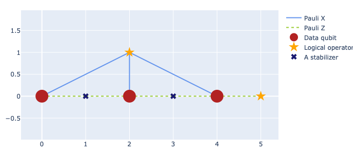

Now, let's use ``plaquette`` to generate errors on the code, perform the
stabilizer measurements and obtain a syndrome. For this, we will need some
additional modules:

>>> from plaquette.errors import QubitErrorsDict
>>> from plaquette.device import Device, MeasurementSample
>>> from plaquette.circuit.generator import generate_qec_circuit

As we will need this more often, we will define a function
``get_syndrome_from_deterministic_error`` to obtain the syndrome of a code when
we place specific errors on the qubits. This function has three parameters:

- ``code``: an instance of ``plaquette``'s error correction codes, :class:`.LatticeCode`.
- ``qubit_errors``: a dictionary containing the qubits and the errors that you want to apply
  on those qubits.
- ``logical_ops``: a string necessary to create the quantum circuit used in simulations. At
  this moment, it is not necessary for you to worry about this last requirement.

>>> def get_syndrome_from_deterministic_error(code, qubit_errors: dict[int: list[str]], logical_ops="X"):
...     qed: QubitErrorsDict = {
...         "pauli": {i: {error: 1 for error in qubit_errors.get(i)} for i in qubit_errors.keys()}
...     }
...     circuit = generate_qec_circuit(code, qed, {}, logical_ops)
...     device = Device("clifford")
...     device.run(circuit)
...     raw_results, erasure = device.get_sample()
...     sample = MeasurementSample.from_code_and_raw_results(code, raw_results, erasure)
...     return sample.syndrome[0]

.. hint::

    Check out ``plaquette``'s `Quickstart guide <https://docs.plaquette.design/quickstart.html>`_
    to learn more about everything used in the function. A short summary: first, we create a
    dictionary ``qed`` that contains the error probabilities for each type of error on each
    qubit. For now, this probability is set to 1 because we want to apply these errors
    deterministically. Then, a ``circuit`` is generated. This is the circuit where the
    quantum code is initialized, the errors appear, and the stabilizer measurements are
    carried out. Then, a new "device" is created to run the ``circuit`` we generated,
    and it is used to obtain a sample of measurements and erasures (the latter are ignored
    for the remainder of this tutorial). The raw results are processed into a syndrome, and
    the syndrome is returned.

Use the code block below to represent graphically the syndrome of a given error.
Feel free to change the ``qubit_errors`` parameter and re-run the code block to
see the syndrome of your new error. The default error is an :math:`X` error on the
first qubit of the chain. You can add as many errors as you want, and observe
the syndromes obtained in each case. To do this, change the parameter ``qubit_errors`` provided
to the ``get_syndrome_from_deterministic_error`` method. We suggest starting with the the
following errors:

-  ``{0: ["x"]}``
-  ``{1: ["x"]}``
-  ``{2: ["x"]}``

>>> syndrome = get_syndrome_from_deterministic_error(code = repetition_code, qubit_errors = {0:["x"]})
>>> vis.draw_latticedata(height=300, syndrome=syndrome)

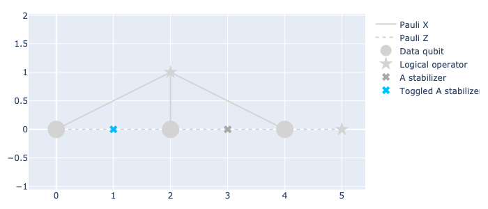

If you have tested the three suggested errors and observed carefully the syndromes obtained
with each one of them, you will be starting to understand how
are the individual :math:`X` error reflected in the syndrome. Now, try to input the
following errors, which contain errors on multiple individual qubits, and compare this syndromes
with the ones obtained above:

-  ``{1: ["x"], 2: ["x"]}``
-  ``{0: ["x"], 2: ["x"]}``
-  ``{0: ["x"], 1: ["x"]}``

From these new examples, you might have learned two things:

- First of all, the measurement result of an ancilla does not tell you exactly if
  an error appeared in its neighboring qubits, it only tells you that an error
  anti-commutes with the stabilizer measured with that ancilla. If we only had a
  single error ``{0: ["x"]}``, we see that the first stabilizer measurement
  is toggled. If we only have the error ``{1: ["x"]}``, we see that both
  stabilizer measurements are toggled (this error anti-commutes with two
  stabilizers). But when we apply the composed error ``{0: ["x"], 1:["x"]}``,
  only one stabilizer measurement is toggled. This is because the first
  stabilizer, :math:`Z_0Z_1` anti-commutes with :math:`X_0`, but it also
  anti-commutes with :math:`X_1`. The anti-commutation of the two is cancelled
  out, and thus :math:`Z_0Z_1` commutes with :math:`X_0X_1`. A stabilizer
  measurement is toggled only when there is an odd amount of operators in the error
  that anti-commute with the stabilizer.

- Second, you may have noticed that the syndromes obtained by these errors are
  the same as the syndromes obtained with the previous set of errors. This tells
  us that a syndrome is degenerate, i.e., different errors can give the same
  syndrome.

Try to also use the following error ``{0: ["x"], 1: ["x"], 2: ["x"]}``.
As you might notice, this error toggles no stabilizer! This is because this
error is actually the logical error :math:`\bar{X}`, which is not detectable.

Maybe you can already guess what happens when applying :math:`Z` errors, such as:

-  ``{0: ["z"]}``
-  ``{1: ["z"]}``
-  ``{2: ["z"]}``
-  ``{0: ["z"], 1: ["z"]}``
-  ``{1: ["z"], 2: ["z"]}``
-  ``{0: ["z"], 2: ["z"]}``

As you can see, the measurement is always the same, we are not detecting
any errors at all! This is because the stabilizers of the code are all
products of :math:`Z` operators, and then :math:`Z` errors commute with
all of them, and these types of errors will be forever undetected.
This means we need to improve our quantum error correction code, by
adding *something* capable of detecting both types of errors.

Surface codes
-------------

There exists a whole class of QEC codes called **surface codes**. This
stems from the fact that stabilizers and logical operators are
given by the distribution of qubits and ancillas in a 2D lattice
[``Kitaev, 1997``]. In surface codes, one defines two types of
stabilizers, namely :math:`X`-type stabilizers and :math:`Z`-type
stabilizers. This makes Surface Codes of great interest because they can
detect for any type of error that may arise in the code, instead of only
detecting errors of a single type as the quantum repetition code.

We don't know how our stabilizers look like yet, but we do know that in
our code we will need data-qubits and ancillas for measuring the stabilizers.
We have two types of stabilizers, so it follows that we should divide the ancillas
into two categories: :math:`X`-type ancillas (ancillas responsible for measuring
the :math:`X`-type stabilizers) and :math:`Z`-type ancillas (ancillas
responsible for measuring the :math:`Z`-type stabilizers). In order to make
our code scalable (easily increase its size), we decide to order the data-qubits
and the ancillas in a lattice.

In order to make these codes easier to implement by experimentalists, we also
want our stabilizers to be defined in such a way that, when measuring them,
we only make use of nearest-neighbor interactions.

In these codes, a stabilizer is defined by taking an ancilla, checking
its type (:math:`X` or :math:`Z`) and applying those gates to the
nearest neighbors of the ancilla within the lattice. The logical
operators are given by finding a chain of operators that commutes with
all stabilizers.

We will review three of the literature's most used quantum error correction
codes, which are able of detecting any single-qubit Pauli error, learn about
their advantages and get familiar with the emergence of errors on these
codes, so that we know what syndrome should we expect to obtain if we know
the shape of an error.

The planar code
~~~~~~~~~~~~~~~

Among the surface codes, one of great interest is the *planar code*.
The reason why this code is being used constantly in the field of quantum
error correction is because:

- In this code, ancillas only interact with their nearest neighboring data-
  qubits, and hence it does not require long distance interactions, making it
  easier to create a planar code experimentally.
- It is based on a lattice, whose size can be ever-increased easily
  by following the lattice's patterns in order to increase the **distance**
  of the code. For small values of the error probabilities, the rate at which
  logical errors appear on the code decreases as one increases the **distance**.

For this code, the logical :math:`\bar{Z}` is defined by the application of
:math:`Z` gates on the qubits lying at the bottom side of the lattice.
The logical :math:`\bar{X}` is defined by the application of :math:`X`
gates on the qubits lying on the left side of the lattice. The distance
of a planar code is equal to the amount of data-qubits lying on a side of
the lattice.

We can create a planar code using ``plaquette``:

>>> planar_code = LatticeCode.make_planar(size=3, n_rounds=1)

We use the ``LatticeVisualizer`` to inspect the code graphically. We
use the same symbology for data-qubits, logical gates on the qubit,
and entangling gates as in the previous representation. The only
difference is that now we have two types of ancillas: :math:`X`-type
ancillas, represented by the blue tilted crosses, and :math:`Z`-type
ancillas, represented by the green crosses.

>>> vis = visualizer.LatticeVisualizer(planar_code)
>>> vis.draw_lattice(height=300)

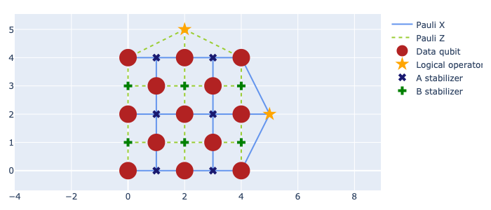

Let's take a look at how the syndrome looks given different
errors on the code. You should try to place single qubit errors
on any of the :math:`d^2 + (d-1)^2` data-qubits (where :math:`d` is the
distance of the code) by making use of the previously-defined function
``get_syndrome_from_deterministic_error``, to get a better idea of how
every error affects the syndrome. By understanding this, you might start
getting ideas of what errors could have produced more complicated codes and
develop strategies to correct them (although there is no need to develop
this strategies on your own, as we will see in the next chapter, there already
exist some ways of coming up with accurate corrections fast).

.. note::

    The planar code of distance :math:`d=3` has :math:`13` data-qubits,
    so make sure that the indices used when you place the errors are not out
    of bounds!

-  ``{i: ["x"]}`` for any ``i`` between 0 and :math:`d^2 + (d-1)^2 -1`.
-  ``{i: ["z"]}`` for any ``i`` between 0 and :math:`d^2 + (d-1)^2 -1`.
-  ``{i: ["y"]}`` for any ``i`` between 0 and :math:`d^2 + (d-1)^2 -1`.

>>> syndrome = get_syndrome_from_deterministic_error(planar_code, {0: ["x"]})
>>> vis.draw_latticedata(height=300, syndrome=syndrome)

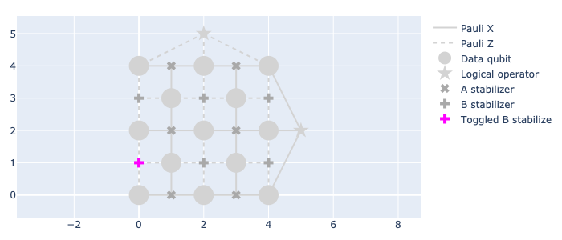

You might have noticed that a :math:`Y` error acting on a qubit
has the same effect on the syndrome as an :math:`X` error and a
:math:`Z` error. This is because the Pauli operator :math:`Y` is
proportional to the application of :math:`XZ` up to a global phase. This
global phase does not show up in the syndrome or in any kind of measurements,
because the outcome of a measurement is the eigenvalue of the measured state.

You could also try the following errors:

-  ``{0: ["x"], 3: ["x"], 5: ["x"]}``
-  ``{1: ["x"], 3: ["x"], 4: ["x"], 6: ["x"]}``
-  ``{2: ["x"], 4: ["x"], 7: ["x"]}``
-  ``{5: ["x"], 8: ["x"], 10: ["x"]}``
-  ``{6: ["x"], 8: ["x"], 9: ["x"], 11: ["x"]}``
-  ``{7: ["x"], 9: ["x"], 12: ["x"]}``
-  ``{0: ["z"], 1: ["z"], 3: ["z"]}``
-  ``{1: ["z"], 2: ["z"], 4: ["z"]}``
-  ``{3: ["z"], 5: ["z"], 6: ["z"], 8: ["z"]}``
-  ``{4: ["z"], 6: ["z"], 7: ["z"], 9: ["z"]}``
-  ``{8: ["z"], 10: ["z"], 11: ["z"]}``
-  ``{9: ["z"], 11: ["z"], 12: ["z"]}``

These errors, as you might have noticed, are the stabilizers
themselves! Because they are the stabilizers, their action on the state
leaves it unchanged (remember:
:math:`g_i \lvert\psi \rangle = \lvert\psi \rangle`). No stabilizers are toggled
for these errors.

Can you guess what happens if you apply a logical error to the code?
These errors do *not* toggle any of the stabilizer measurements!

-  :math:`\bar{X}`: ``{0: ["x"], 1: ["x"], 2: ["x"]}``
-  :math:`\bar{Z}`: ``{0: ["z"], 5: ["z"], 20: ["z"]}``

More interesting error patterns can come out, and you are
encouraged to test multiple errors of different types on
several different qubits to explore how chains of errors
might appear on the code. Here's a couple of
suggestions:

-  ``{3: ["x"], 9: ["z"]}``
-  ``{3: ["z"], 9: ["x"]}``
-  ``{0: ["x"], 6: ["z"], 12: ["y"]}``
-  ``{3: ["x"], 4: ["x"]}``
-  ``{3: ["z"], 4: ["z"]}``
-  ``{3: ["y"], 4: ["y"]}``
-  ``{3: ["x"], 6: ["x"]}``
-  ``{3: ["z"], 6: ["z"]}``
-  ``{3: ["y"], 6: ["y"]}``
-  ``{3: ["x"], 4: ["x"], 8: ["x"]}``
-  ``{3: ["z"], 4: ["z"], 8: ["z"]}``
-  ``{3: ["x"], 6: ["x"], 9: ["x"]}``
-  ``{3: ["z"], 6: ["z"], 9: ["z"]}``
-  ``{3: ["y"], 4: ["y"], 8: ["y"]}``
-  ``{3: ["y"], 6: ["y"], 9: ["y"]}``

These examples are instructive to see what happens to the
syndrome in the presence of certain error patterns. We did cherry-pick
some of these patterns to highlight particular effects (e.g. errors that do
not toggle any syndrome bit), but it's time to abandon this "toy model".
Errors do not appear deterministically as they have up until now, but
rather they appear at random with a given probability. We can make
use of ``plaquette``'s simulator to model what happens when more
realistic error models are taken into account.
We might want to run a single scenario multiple times
to see how errors randomly appear in the code and produce different
syndromes.

We define the function ``get_syndrome_from_random_error`` to obtain a syndrome of a code with a
specified error probability distribution. Given that now we are providing a probability
distribution instead of deterministic instructions, multiple calls of this function with
the same parameters might output different syndromes, because in one sample some errors
might be present, and other errors might appear in a new sample. This function has three
parameters:

- ``code``: an instance of ``plaquette``'s error correction codes, ``LatticeCode``.
- ``qed``: a dictionary of the type ``plaquette.errors.QubitErrorData``, containing the error
  probability distribution.
- ``logical_ops``: a string necessary to create the quantum circuit used in simulations. At
  this moment, it is not necessary for you to worry about this last requirement.

>>> def get_syndrome_from_random_error(code, qed, logical_ops="Z"):
...     circuit = generate_qec_circuit(code, qed, {}, logical_ops)
...     device = Device("clifford")
...     device.run(circuit)
...     raw_results, erasure = device.get_sample()
...     sample = MeasurementSample.from_code_and_raw_results(code, raw_results, erasure)
...     return sample.syndrome[0]

.. hint::

    This function is very similar to ``get_syndrome_from_deterministic_error``. The only change is
    that you must now provide an error distribution instead of deterministic instructions
    of where should errors be placed. The errors are chosen at random from the distribution
    and the syndrome for that sample is output.

Let's first begin by giving each of the :math:`X`, :math:`Y` and
:math:`Z` errors a probability of 0.2 of appearing on the data-qubit with
index 6 (the one lying in the center of the planar code of distance 3).
Feel free to run this cell as many times as you want to see that the outcome
changes from time to time, depending on the error probabilities. There are
even some cases where no error is applied.

>>> qed: QubitErrorsDict = {
...     "pauli": {6: dict(x=0.2, y=0.2, z=0.2)}
... }
>>> syndrome = get_syndrome_from_random_error(planar_code, qed)
>>> vis.draw_latticedata(height=300, syndrome=syndrome)

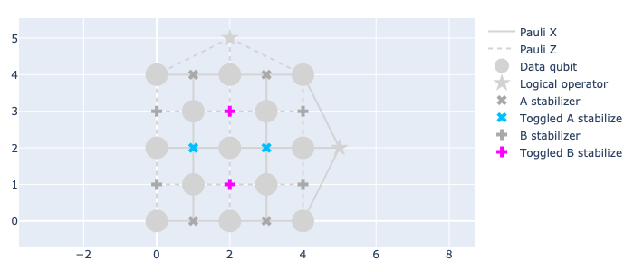

Now, let's try to see what would happen if we give every qubit in the
code a probability of 0.1 of suffering an :math:`X`, :math:`Y` and :math:`Z` errors. You might want to
try to guess what errors acted on which qubits in order to give this
syndrome. If you are unsure whether it was one error combination
or another, remember that there are no wrong answers: in that case
the syndrome is degenerate.

.. code-block:: python3

    qed: QubitErrorsDict = {
            "pauli": {i: dict(x=0.1, y=0.1, z=0.1) for i in range(planar_code.n_data_qubits)}
        }
    syndrome = get_syndrome_from_random_error(planar_code, qed)
    vis.draw_latticedata(height=300, syndrome=syndrome)

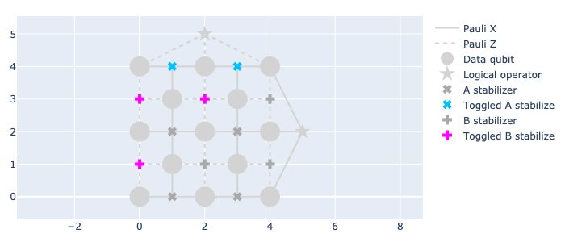

The rotated planar code
~~~~~~~~~~~~~~~~~~~~~~~

There is another surface code called the *rotated planar code*
[``Bombin, 2007``]. As its name suggests, this code is obtained by
rotating the planar code of distance :math:`d` counter-clock-wise by
45°. Then, one identifies a square lattice with :math:`d` data-qubits on
each side. This square lattice (along with some additional stabilizers)
are kept, and the rest of the qubits are discarded. The following image
shows how the rotated planar code is obtained:

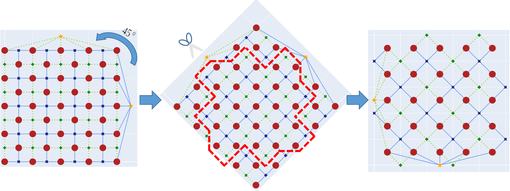

The rotated planar code has become of great interest because it poses the same
advantages as the planar code: it contains only nearest-neighbor interactions
and it can be easily scaled. However, it also presents an additional advantage
over the planar code: a rotated planar code of distance :math:`d` can be
constructed using nearly half the number of qubits needed for a planar code with
equivalent distance. This further leads to a reduced number of stabilizers,
implying fewer required measurements.

The rotated planar code has :math:`d^2` data qubits and :math:`d^2-1`
stabilizers, where :math:`d` is the distance of the code. This means that
this code only has one degree of freedom, or said differently, it encodes
one logical qubit.

In the rotated planar code, above the top side and below the bottom side,
we can find additional  :math:`Z`-type stabilizers. Outside of the left and
right sides, we find :math:`X`-type stabilizers. The logical :math:`\bar{X}`
is defined by the application of :math:`X` gates on the bottom side of the
lattice, and the :math:`\bar{Z}` is obtained by applying :math:`Z` gates on
the left side of the lattice.

We can get a rotated planar code from ``plaquette`` by calling:

>>> rotated_planar_code = LatticeCode.make_rotated_planar(size=3, n_rounds=1)

As with the other codes, we can also have a look at it:

>>> vis = visualizer.LatticeVisualizer(rotated_planar_code)
>>> vis.draw_lattice(height=300)

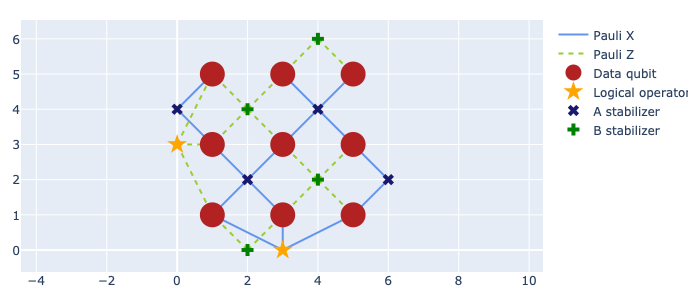

Being very similar to the planar code, what do you think would happen
if you use the error patterns that we have explored previously? You
should try some of them out on the rotated version! In doing so, you should
learn how does an error on each qubit affects the syndrome.

.. note::

    The rotated planar code of distance :math:`d=3` has :math:`9`
    data-qubits, so make sure that the indices used when you place the errors
    are not out of bounds!

-  ``{i: ["x"]}`` for any ``i`` between 0 and :math:`d^2-1`.
-  ``{i: ["z"]}`` for any ``i`` between 0 and :math:`d^2-1`.
-  ``{i: ["y"]}`` for any ``i`` between 0 and :math:`d^2-1`.

>>> syndrome = get_syndrome_from_deterministic_error(rotated_planar_code, {0: ["x"]})
>>> vis.draw_latticedata(height=300, syndrome=syndrome)

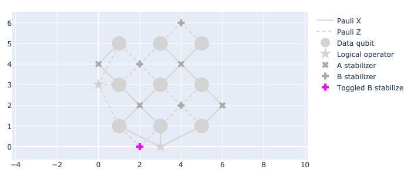

And again, what happens if you apply the stabilisers? Here's a list to
get you started:

-  ``{1: ["x"], 2: ["x"]}``
-  ``{0: ["x"], 1: ["x"], 3: ["x"], 4: ["x"]}``
-  ``{4: ["x"], 5: ["x"], 7: ["x"], 8: ["x"]}``
-  ``{6: ["x"], 7: ["x"]}``
-  ``{0: ["z"], 3: ["z"]}``
-  ``{1: ["z"], 2: ["z"], 4: ["z"], 5: ["z"]}``
-  ``{3: ["z"], 4: ["z"], 6: ["z"], 7: ["z"]}``
-  ``{5: ["z"], 8: ["z"]}``

You can also apply the logical operators, and make sure that they do not
toggle any of the stabilizer measurements:

-  :math:`\bar{X}` ``{1: ["x"], 3: ["x"], 6: ["x"]}``
-  :math:`\bar{Z}` ``{0: ["x"], 1: ["x"], 2: ["x"]}``

An alternative error pattern that you could check out might be a 10%
probability per qubit of either :math:`X`, :math:`Y`, or :math:`Z`
errors, to see how errors emerge in a more realistic scenario.
There are :math:`2^{d^2-1}` different syndromes that can be obtained
by the :math:`4^{d^2}` possible errors! You might have started to grasp
and comprehend the complexity of the topic.

>>> qed: QubitErrorsDict = {
...     "pauli": {i: dict(x=0.1, y=0.1, z=0.1) for i in range(rotated_planar_code.n_data_qubits)}
... }
>>> syndrome = get_syndrome_from_random_error(rotated_planar_code, qed)
>>> vis.draw_latticedata(height=300, syndrome=syndrome)

.. figure:: rot3_rand_syn.png

The toric code
~~~~~~~~~~~~~~

The toric code is similar to the planar code, but with periodic boundary
conditions.
The toric code was the first surface code to ever be proposed in the field of
quantum error correction. However, the long-distance interactions given by
the periodicity in the lattice makes it a less interesting candidate for
experimental applications. It is still important to learn it and get familiar
with it. The papers presenting and proposing new decoders, i.e., the
algorithms used to find corrections (move on to the next tutorial to find out more
about decoders!), tend to use the toric code as the environment to show and test
their algorithms.

The toric code is also interesting because it encodes **two** logical qubits,
instead of only one, as the planar and rotated planar codes do.

The toric code has :math:`2d^2` qubits and :math:`2d^2`
stabilizers. However, from these stabilizers only :math:`2d^2-2` are
independent, which is why two logical qubits are available. This means
that we need to define two logical operators of each type:
:math:`\bar{X}^{(0)}`, obtained by applying :math:`X` gates on the left
side of the lattice; :math:`\bar{Z}^{(0)}`, obtained by applying
:math:`Z` gates on the top side of the lattice; :math:`\bar{X}^{(1)}`,
obtained by applying :math:`X` gates on the bottom side of the lattice;
and :math:`\bar{Z}^{(1)}`, obtained by applying :math:`Z` gates on the
right side of the lattice.

Since it's a common code found in the literature, ``plaquette`` has
native support for it:

>>> toric_code = LatticeCode.make_toric(size=3, n_rounds=1)
>>> vis = visualizer.LatticeVisualizer(toric_code)
>>> vis.draw_lattice(height=350)

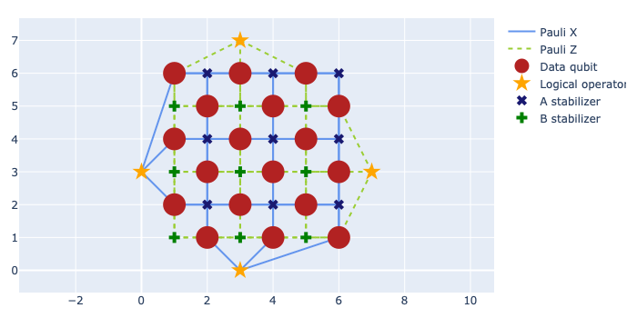

You might want to observe the syndrome generated by each type of
error on each individual qubit.

.. note::

    The toric code of distance :math:`d=3` has :math:`18` data-qubits.
    Again, keep in mind that the indices in the errors should not exceed the
    number of available data-qubits.

-  ``{i: ["x"]}`` for any ``i`` between 0 and :math:`2d^2-1`.
-  ``{i: ["z"]}`` for any ``i`` between 0 and :math:`2d^2-1`.
-  ``{i: ["y"]}`` for any ``i`` between 0 and :math:`2d^2-1`.

>>> syndrome = get_syndrome_from_deterministic_error(toric_code, {0: ["x"]}, logical_ops="XX")
>>> vis.draw_latticedata(height=350, syndrome=syndrome)

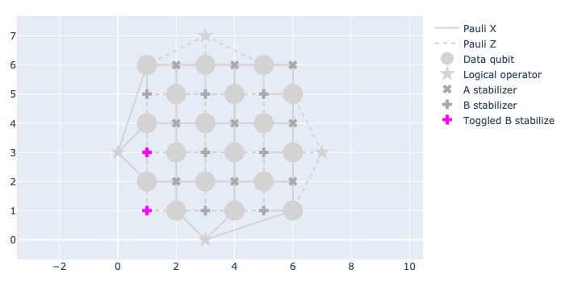

You can apply the stabilizers and see for yourself that they don't toggle any of the
measurements:

-  ``{0: ["x"], 3: ["x"], 4: ["x"], 6: ["x"]}``
-  ``{1: ["x"], 4: ["x"], 5: ["x"], 7: ["x"]}``
-  ``{2: ["x"], 3: ["x"], 5: ["x"], 8: ["x"]}``
-  ``{6: ["x"], 9: ["x"], 10: ["x"], 12: ["x"]}``
-  ``{7: ["x"], 10: ["x"], 11: ["x"], 13: ["x"]}``
-  ``{8: ["x"], 9: ["x"], 11: ["x"], 14: ["x"]}``
-  ``{0: ["x"], 12: ["x"], 15: ["x"], 16: ["x"]}``
-  ``{1: ["x"], 13: ["x"], 16: ["x"], 17: ["x"]}``
-  ``{2: ["x"], 14: ["x"], 15: ["x"], 17: ["x"]}``
-  ``{0: ["z"], 2: ["z"], 3: ["z"], 15: ["z"]}``
-  ``{0: ["z"], 1: ["z"], 4: ["z"], 16: ["z"]}``
-  ``{1: ["z"], 2: ["z"], 5: ["z"], 17: ["z"]}``
-  ``{3: ["z"], 6: ["z"], 8: ["z"], 9: ["z"]}``
-  ``{4: ["z"], 6: ["z"], 7: ["z"], 10: ["z"]}``
-  ``{5: ["z"], 7: ["z"], 8: ["z"], 11: ["z"]}``
-  ``{9: ["z"], 12: ["z"], 14: ["z"], 15: ["z"]}``
-  ``{10: ["z"], 12: ["z"], 13: ["z"], 16: ["z"]}``
-  ``{11: ["z"], 13: ["z"], 14: ["z"], 17: ["z"]}``

You can also apply the logical errors:

-  :math:`\bar{X}^{(0)}`: ``{0: ["x"], 1: ["x"], 2: ["x"]}``
-  :math:`\bar{Z}^{(0)}`: ``{2: ["z"], 8: ["z"], 14: ["z"]}``
-  :math:`\bar{X}^{(1)}`: ``{3: ["x"], 9: ["x"], 15: ["x"]}``
-  :math:`\bar{Z}^{(1)}`: ``{15: ["z"], 16: ["z"], 17: ["z"]}``

Moving to more realistic scenarios, you can also give an error probability
distribution to all qubits, where each qubit has probability of 0.1 of suffering
an :math:`X`, :math:`Y` and :math:`Z` error, and run the cell multiple times to
see how stabilizers might be toggled in a real quantum device.

>>> qed: QubitErrorsDict = {
...     "pauli": {i: dict(x=0.1, y=0.1, z=0.1) for i in range(toric_code.n_data_qubits)}
... }
>>> syndrome = get_syndrome_from_random_error(toric_code, qed, logical_ops="XX")
>>> vis.draw_latticedata(height=300, syndrome=syndrome)

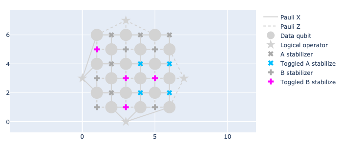

Summary
-------

At this point, you have learned the concept of an error-correcting code and why
is it useful to have additional qubits to protect our information. You have also
learned the stabilizer formalism, a tool used to develop and analyse quantum
error correction codes. The stabilizer formalism also tells us what kind of
non-destructive measurements we have to perform in order to detect errors.

You have studied a simple code, the quantum repetition code, where you have put
in practice the techniques of encoding and detection of errors. You have learned
what to expect in the syndrome when certain errors act on the qubits. You have
also learned about the disadvantages of this code, where it can only detect one
type of errors.

This problem with the quantum repetition code can be solved by moving towards
surface codes. These are scalable codes able to detect any kind of single-qubit
errors. You have used the library ``plaquette`` to interact with a quantum code,
explore various error patterns and learn how these errors produce different
(or the same) syndromes.

Now that we know how to encode logical qubits into many physical qubits and how to
perform measurements to detect errors, we might be interested in learning
what can we do when we encounter these errors. In the next tutorial, we introduce
decoders, which are algorithms that take as input a syndrome and use some
arguments to create a correction operator that can be applied to the quantum
code in order to correct the error and recover the original state of our code.

Bibliography
------------

-  W. K. Wootters and W. H. Zurek, “A single quantum cannot be cloned,”
   Nature, vol. 299, pp. 802–803, Oct. 1982. Number: 5886 Publisher:
   Nature Publishing Group.
-  D. Gottesman, “Stabilizer Codes and Quantum Error Correction,” May
   1997. arXiv:quant-ph/9705052.
-  A. Y. Kitaev, “Quantum computations: algorithms and error
   correction,” Russian Mathematical Surveys, vol. 52, p. 1191,
   Dec. 1997. Publisher: IOP Publishing.
-  H. Bombin and M. A. Martin-Delgado, “Optimal resources for
   topological two-dimensional stabilizer codes: Comparative study,”
   Physical Review A, vol. 76, p. 012305, July 2007. Publisher: American
   Physical Society.
