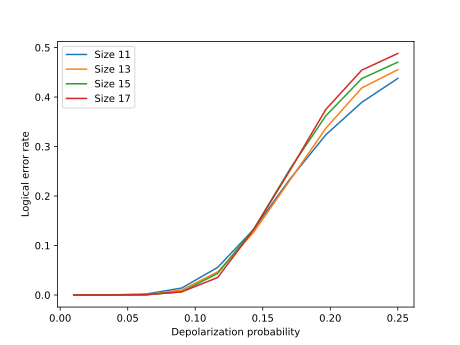
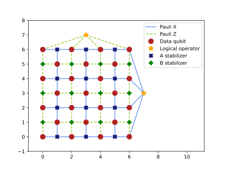
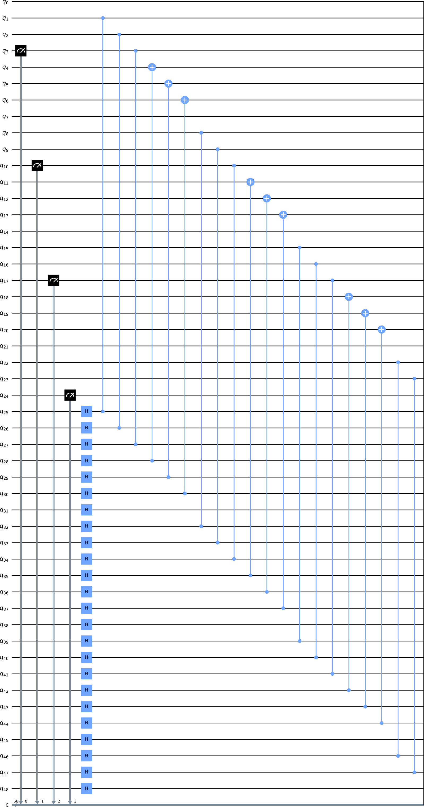
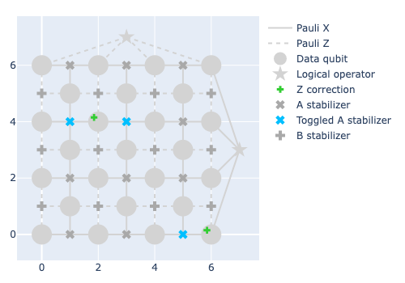

.. Copyright 2023, QC Design GmbH and the plaquette contributors
   SPDX-License-Identifier: Apache-2.0

.. _quickstart:

Quickstart
==========

  *One does not simply write documentation without a quickstart*

  -- Boromir, if he wrote code

No software library or application would ever be considered complete without
the ever-green "Quickstart" section, and ``plaquette`` is no stranger to the
cliche. We will go through all the steps necessary for you to make a simple
but imporant type of simulation in the ``plaquette`` way: calculating the
:term:`threshold` of a quantum error correcting code. We choose this particular
example because it touches *all* aspects of the library, albeit in a very
opinionated way.

Every step of the way, we will link to the appropriate
:doc:`API documentation <apidoc/plaquette>` pieces, if you want to delve
deeper into the library.

.. hint:: You can find a slimmed down version of this quickstart as an
   executable script with Spyder-type cells in the ``examples/quickstart.py``
   file in the main repository.

Why "thresholds" as a benchmark for quantum error correction library?
---------------------------------------------------------------------

We believe in the promise of quantum computing (otherwise why bother with
such a library?), but we are also well-aware of its current limitations.
Physical qubits are nowhere near the necessary error rates to compete with
classical computing so finding a way to exponentially reduce these rates to
acceptable levels is paramount. This is where threshold calculations come into
play. Thresholds are crucial for quantum error correction as they define the
dividing line between error rates that can be corrected and those that cannot.

To illustrate this concept, let's consider a plot that relates the physical and
logical error rates.

   The threshold point of the planar surface code for different code sizes
   and error probabilities (for a specific type of error mechanism).

On the x-axis, we have the physical error rate, which represents the quality of
the physical qubits, while the y-axis shows the logical error rate,
representing the probability of performing a logical computation without error.
We plot this relationship for various numbers of qubits.

In the right side of the plot, *increasing* the number of physical qubits per
logical qubit leads to a *higher* logical error rate. Conversely, on the left
side of the plot, **increasing** the number of physical qubits per logical qubit
**decreases** the logical error rate! This is great because we can simply throw
more qubits at it and get the logical error rate as low as we want! We're not
making the statement that doing so is financially feasible or at all practical,
**but** it's promising nonetheless! The point in which this plot is "naturally"
separated is called *threshold*.

Of course life (and machines) is more complicated than that, and multiple
error mechanisms will compete for your attention so a threshold might be
(and usually *is*) a much more "high dimensional" concept than what we just
described, but this is a quick start, not the Nielsen & Chuang, so we
won't deal with multiple error mechanisms, or at least not in detail.

We will exploit this concept of a threshold in quantum error correction to
showcase how you can use ``plaquette`` to study fault tolerance, from defining
a code, transforming it into a simulatable circuit, to finally getting the
plot above. Let's go!

Seeding the simulation
----------------------

Calculating the threshold is a worthy goal, but usually you want to calculate
the threshold of a *code*, i.e. a :term:`QECC`, so we need one. Before showing
you how to get a hold of one though, there's something that we need to take
care of, and that is *randomness*.

``plaquette`` is a simulation tool, and sometimes it needs to deal with
probabilistic events, in which case it needs a source of randomness. This
is good in general, but you might want to have *reproducible* randomness
for showing some results to a colleague without an awkward "I swear it
worked", **or** when following along a guide or a quickstart. ``plaquette``
uses randomness in a few places so it makes it simple to set a single
random generator for all possible components that need it. When working
with ``plaquette`` you can set a given RNG with a seed of your choice at
the beginning of your simulation script

>>> import numpy as np
>>> import plaquette
>>> plaquette.rng = np.random.default_rng(seed=1234567890)

.. important:: There's two things you need to pay attention to here, in
   order not to shoot yourself in the foot.

   1. You should set your RNG *only once* and *as the very first thing* you do
      in ``plaquette``.
   2. Because of how Python works, you should **really** only import
      ``plaquette`` by itself. Using::

         from plaquette import rng
         rng = # anything

      **will not work as you think**.

.. admonition:: Why not use :func:`numpy.random.seed()`?
   :class: question

   As the numpy docs themselves mention, that is a legacy functionality used
   as a way to keep compatibility with an old API. We decided to implement
   the new API from numpy, namely the :class:`~numpy.random.Generator` class,
   which is what the ``plaquette.rng`` attribute should be set to. The
   recommended way to make such a generator is by using the
   :func:`numpy.random.default_rng` function, which is exactly what happens
   when you first import ``plaquette``: a new RNG is created with a random
   seed.

Choosing a code to study
------------------------

We're setting out to study the :term:`threshold` behaviour of a :term:`QECC`,
so we need to choose one. One of the most studied ones is the planar code and,
given its ubiquity, ``plaquette`` makes it simple to use with zero effort.

>>> from plaquette.codes import LatticeCode
>>> code = LatticeCode.make_planar(n_rounds=1, size=4)
>>> code  # doctest: +ELLIPSIS
<plaquette.codes.LatticeCode object at ...>

That's it. ``code`` is a :class:`.LatticeCode` object, and if
you're curious about its inner workings you can have a look at its API. For
our purposes (of being in the middle of a *quick* start), we don't care
too much. The only important thing to remember is that ``.LatticeCode`` is a
:term:`QECC` defined on a *square lattice*, hence the name.

.. note:: As you might have guessed, there are other common codes that
   ``plaquette`` supports and fittingly there is a ``make_*`` method for
   each of them, listed in the :class:`.LatticeCode` API
   description, where the asterisk is just a placeholder for the various types
   of code you might want to create and which are currently implemented (e.g.
   :meth:`~.LatticeCode.make_toric`, :meth:`~.LatticeCode.make_planar`, etc.).

:class:`.LatticeCode` internally stores a :class:`.CodeLattice`, which is a
graph-like object that contains the relationship between the various
vertices (:class:`~.latticebase.Vertex`) connected via edges
(:class:`~.latticebase.Edge`). You don't need to care about it when using
pre-defined codes, as the lattice will be automatically generated for you, but
you should keep in mind that this exists. It will be especially important if
you want to come up with your own code topologies and implement them in such
a way that ``plaquette`` is able to handle them as if they were some of the
pre-defined ones.

.. seealso:: The page :doc:`/advanced/codes/index` has more in-depth
   information about this topic. You should check that out if the set of
   codes available in ``plaquette`` does not satisfy all your needs.

Take a look!
------------

You can have a look at what a :class:`.LatticeCode` looks like by feeding it to
the :class:`.LatticeVisualizer`.

>>> from plaquette.visualizer import LatticeVisualizer
>>> visualizer = LatticeVisualizer(code)
>>> # if you're in a Jupyter notebook, try visualizer.draw_lattice()
>>> visualizer.draw_lattice_mpl()

   Size-4 planar code as a Matplolib plot

The style of the generated plot is very customisable, although the style
options depend on the backend you use. We will go on with the default values
for now.

.. seealso:: If you're curious, :doc:`/advanced/viz/index` has more info on
   how to deal with the visualizer!

Dealing with imperfections
--------------------------

One of the strong suits of ``plaquette`` is its ability to deal with a growing
amount of error models to better simulate the performance of real, physical
machines. Errors in ``plaquette`` can be specified in a number of ways but we
will cover the most basic one here to keep things short.

At the lowest level, errors in ``plaquette`` are specified for each qubit and
gate that are affected by them. This granularity gives you full control on how
you want to model the imperfections of your code or machine. The downside of
this granularity is the verbosity in the definition of errors. Let's say that
we want to simulate the case in which *all* data qubits are plagued with a
Pauli X channel type of error and erasure errors, which happens with a 5% and
1% chance, respectively. To specify this
manually you would need to create a :class:`.QubitErrorsDict` for all qubits
in your code that are affected by it.

>>> from plaquette.errors import QubitErrorsDict
>>> qed: QubitErrorsDict = {
...     "pauli": {q: {"x": 0.05, "y": 1e-15, "z": 1e-15} for q in range(len(code.lattice.dataqubits))},
...     "erasure": {q: {"p": 0.01} for q in range(len(code.lattice.dataqubits))},
... }
>>> qed  # doctest: +ELLIPSIS
{'pauli': {0: {'x': 0.05, 'y': 1e-15, 'z': 1e-15}, ...}, 'erasure': {0: {'p': 0.01}, ...}}

.. hint::

   ``plaquette`` is heavily
   `type-hinted <https://docs.python.org/3/library/typing.html>`, so that
   modern IDEs and editors can help you better when writing code. In
   particular, all error data specifications use :class:`typing.TypedDict` as
   underlying type-hint, giving you a hand when trying to remember the proper
   dictionary key to use. If you never heard of these "type hints" before,
   don't worry: knowing what they are is absolutely not necessary to work with
   ``plaquette``! They are a very nice programming help though, we highly
   recommend taking advantage of them if you can!

.. note:: Qubit indices in ``plaquette`` currently follow a specific "pattern".
   Given a code with ``n`` data qubits and ``s`` stabilisers, the qubits are
   assigned indices starting with the *data* qubits and then with the
   *ancilla* qubits used for stabiliser measurements. That means that the
   last *data* qubit has index ``n-1``, while the last *ancilla* qubit has
   index ``n+s-1``. When specifying errors, you need to use this indexing
   convention, called sometimes "extended qubit index" in other parts of these
   docs.

Not the worst, but this is a very simple case! There are ways to help you build
more complex situations and error distributions more easily, but they won't be
covered here.

.. important:: There's two ways of specifying errors in ``plaquette``: a
   "low-level" API and a "high-level" API. The low-level API is a collection of
   dictionaries whose format is described in their own sections
   (:class:`.QubitErrorsDict` and :class:`.GateErrorsDict`) and gives you the
   highest flexibility but also the highest verbosity. *This is what ultimately
   gets consumed by the rest of the library*. To streamline setting these
   objects up you can use a higher-level interfaced, described in
   :doc:`/advanced/errors/index`. In particular, the :class:`.ErrorData`
   class can help you set things up and then *produce* the necessary
   dictionaries transparently.

Wiring a circuit
----------------

With a :class:`~.LatticeCode` and error dictionaries, ``plaquette``
allows you to create a :class:`~.Circuit` that can be efficiently simulated.
The underlying :class:`~.CodeLattice` in the code holds the information on how
to measure the stabilisers that make up the selected code, and it's very easy
to turn a code into a Clifford circuit.

.. admonition:: Why would you want to create a circuit? What more information
   does it bring?
   :class: question

   ``plaquette`` is more geared towards practical quantum computing, and that
   means being able to *in principle* test your ideas on a real quantum
   computer, if you have one. A quantum circuit is a universal "language" for
   machines implementing quantum operations, so it's important that we have a
   way to translate our ideas into concepts that a machine can understand and
   act upon!

   Another reason is that simulating *Clifford* circuits (i.e. circuits with a
   restricted set of possible quantum operations) on classical computers can be
   done efficiently, so they are also a very useful simulation tool!

In order to generate a circuit, ``plaquette`` also requires you to specify two
things:

1. how the errors are distributed among qubits and gates;
2. a ``logical_operator`` to check that after the circuit has run its
   eigenvalue has not changed.

The error distribution is important for the generation of the circuit. Knowing
this information in advance allows ``plaquette`` to simulate properly the
noise model you have in mind.

The tracking of the logical operator's eigenvalue is done by measuring the
corresponding Pauli string that defines the logical operator on the given code.

.. note:: You don't need to know *how* the logical operator is defined, you
   simply need to decide *which* you want to check for errors. This is great
   if, for example, you are more interested in how the code performs under
   certain types of error models than in how the definition of the code and
   logical qubits are made up. ``plaquette`` lets you as deep as you want only
   in the things that you care about and it tries to use sensible defaults for
   the rest.

To keep things simple, in the following snippet the empty dictionary ``{}``
indicates perfect gate operations. It's still a required parameter, so we need
to put something anyway. ``qed`` is the :class:`.QubitErrorsDict` we
constructed before.

>>> from plaquette.circuit.generator import generate_qec_circuit
>>> logical_operator = "Z"
>>> circuit = generate_qec_circuit(code, qed, {}, logical_operator)
>>> print(circuit)  # doctest: +ELLIPSIS
M 3
M 10
M 17
...

``plaquette`` has a simple circuit representation, allowing you to define
custom Clifford circuits which are entirely disconnected from a code
definition, if you want. Since we *do* have a code, we don't need to care about
how to translate it to a circuit: :func:`.generate_qec_circuit` will do the
work for us!

.. seealso:: The syntax of a circuit definition is detailed in another part
   of the documentation: :doc:`/ref/circuits`.

You can also have a look at the generated circuit, if you want! ``plaquette``
provides a convenient interface to Qiskit's circuit visualiser. You only need
the following code snippet:

>>> from plaquette.visualizer import CircuitVisualizer
>>> vz = CircuitVisualizer(generate_qec_circuit(code, {}, {}, logical_operator))
>>> vz.draw_circuit()  # doctest: +ELLIPSIS
<Figure size ...>

:meth:`.draw_circuit` will render a normal matplotlib ``Figure``, which you can
then manipulate as you wish. A portion of the circuit (which ends up being
farily big!) is displayed below, just to give you an idea.

   A section of the entire circuit. Click :download:`here <qs_circuit.svg>` to
   download the full circuit as an SVG file!

.. important::

   Since we currently rely on the ``plaquette`` > ``OpenQASM 3.0`` > ``qiskit``
   loop to render a circuit, not *all* circuits supported by ``plaquette``
   devices can be drawn. In particular, any circuit with "error
   instructions" cannot be converted to OpenQASM, hence it cannot be
   visualised. This is why in the above snippet we **did not** use the
   ``circuit`` we had already, but we prepared a new one with an empty error
   dictionary.

Simulating the generated circuit
--------------------------------

*Generating* or *making* a circuit does not automatically *run* it. This is
because ``plaquette`` has different backends to run a circuit which you can
choose from.

To run a circuit, a device has to be created by specifying a backend. Right
now, you have two options to run your circuit locally.

``"clifford"``
   which is a simple, hackable tableau-based simulator for Clifford circuits
   that trades speed for simplicity.

``"stim"``
   an interface for the well-known `Stim`_ simulator, with much better
   performance. This interface class will make sure that the circuit you define
   in ``plaquette`` can be simulated by Stim by translating ``plaquette``'s own
   circuit format to Stim's.

.. _Stim: https://github.com/quantumlib/Stim

Since we are dealing with a rather small circuit, we will select ``"clifford"``
as the backend here. You can create a device by specifying this backend and
then feeding your already-defined ``circuit`` into the ``run`` method of the
device. After running the quantum circuit you can ask for a measurement sample
(or shot in other parts of the literature).

>>> from plaquette import Device
>>> device = Device("clifford")
>>> device.run(circuit)
>>> raw_results, erasure = device.get_sample()
>>> raw_results.shape
(56,)
>>> erasure.shape
(25,)

.. hint::

   A device created using the ``"clifford"`` backend (but not ``"stim"`` or
   other backends) can be used as a Python iterator and supports querying the
   quantum state like this::

      for _ in device:  # each step does not return anything on its own
          # print(device.state)
          # do stuff with device.state
      m, e = device.get_sample()

``raw_results`` holds all single measurement outcomes that the device
obtained while running through the circuit. It contains both measurements
related to the stabilisers themselves, state preparation, and logical
operators.

.. caution::

   Drawing a single sample will make the device run through the entire
   circuit without stopping and will keep accumulating measurement results
   such that, at each new sample, ``raw_results`` and ``erasure`` will have
   *all* results from all samples, and the internal quantum state will be
   whatever it was after the previous circuit finished running. If you want to
   generate many samples starting always from a clean state, you can call
   ``device.get_sample(after_reset=True)`` instead. This will reset the
   corresponding internal attributes of local backends used.

Since we didn't manually make this circuit, but rather it was generated from
a code, we make sense of the single values in this array by "unpacking it"
with the help of :meth:`.MeasurementSample.from_code_and_raw_results`.

>>> from plaquette.device import MeasurementSample
>>> sample = MeasurementSample.from_code_and_raw_results(code, raw_results, erasure)

The :class:`.MeasurementSample` object contains a wealth of information about our
simulation shot. In particular, it contains the necessary data that are
necessary for *decoding* the errors that might have happened while our circuit
was running.

Decoding and correcting errors
------------------------------

There would be no point in quantum error *correction* without *correcting*
anything, and simply taking the results from the simulation at face value.
This is where the "second half" of ``plaquette`` comes into play: its decoders.

Given the chosen :class:`.LatticeCode`, its error models, and the obtained
:class:`.MeasurementSample` you can now feed all these information to one of the
decoders implemented or supported by ``plaquette``.

``plaquette`` tries to abstract away the differences between the various
decoders and give you a uniform interface. I mean, a decoder needs to do
*one* thing: tell you which correction operator to apply in order to correct
errors, if any. This is where the
:mod:`~plaquette.decoders.decoderbase.DecoderInterface` comes into play. This
is the common interface to all decoders ``plaquette`` supports. Currently,
``plaquette`` supports the following decoders:

:class:`~.interfaces.PyMatchingDecoder`
   which is an interface to
   `PyMatching <https://pymatching.readthedocs.io/en/latest/>`_;
:class:`~.interfaces.FusionBlossomDecoder`
   which is an interface to
   `fusion-blossom <https://github.com/yuewuo/fusion-blossom>`_;
:class:`~.interfaces.UnionFindDecoder`
   which is a custom implementation of the Union Find
   :cite:`delfosse_almost-linear_2021` algorithm written in Python.

In particular, the :class:`~plaquette.decoders.interfaces.UnionFindDecoder` decoder,
is a unique feature of ``plaquette``, and it's the only decoder that supports
erasure errors, which we have defined above.

All decoders, being a specialization of the generic :class:`.DecoderInterface`,
have the same two important user-facing methods:
:meth:`~.DecoderInterface.from_code` and :meth:`~.DecoderInterface.decode`.
The first sets the decoder up, including the internal :class:`.SyndromeGraph`,
and the second will try to calculate the necessary correction operator given
the results of the simulation and error data information.

.. hint:: *All* decoders have *the same* public-facing API, meaning that they
   are drop-in replacement for one-another. In the following snippet,
   replacing ``UnionFindDecoder`` with ``PyMatchingDecoder`` or with
   ``FusionBlossomDecoder`` is enough to use a radically different decoding
   algorithm on *the same* input code and measurement outcomes!

>>> from plaquette.decoders import UnionFindDecoder
>>> decoder = UnionFindDecoder.from_code(code, qed, weighted=True)
>>> correction = decoder.decode(sample.erased_qubits, sample.syndrome)
>>> correction  # doctest: +ELLIPSIS
array([...], dtype=uint8)

To quickly check whether decoding was successful or not you can use the
:func:`.check_success` function.

>>> from plaquette.decoders.decoderbase import check_success
>>> check_success(code, correction, sample.logical_op_toggle, logical_operator)
True

Success! You can even plot the correction applied if you're curious to see
your results in a more graphical way.

>>> fig = visualizer.draw_latticedata(
...     syndrome=sample.syndrome[0], correction=[correction]
... ).update_layout(width=500, height=350)
>>> # fig.show()  # would show the picture in a browser window

.. note:: While visualising the main lattice is possible both via
   `matplotlib <https://matplotlib.org>`_ and `plotly <https://plotly.com>`_,
   currently visualisation of the results of decoding and simulation is only
   possible via the latter.

Putting it all together: calculating thresholds
-----------------------------------------------

We have covered all most important aspects of ``plaquette``: selecting a code,
including error information, generating and simulating a circuit from said
code and error information, and finally checking whether our logical qubit
was flipped or not.

We can put all of this together and calculate what's the average *logical
error rate*.

>>> successes = 0
>>> reps = 1000
>>> for i in range(reps):
...     device.run(circuit)
...     raw, erasure = device.get_sample()
...     results = MeasurementSample.from_code_and_raw_results(code, raw, erasure)
...     correction = decoder.decode(results.erased_qubits, results.syndrome)
...     if check_success(
...         code, correction, results.logical_op_toggle, logical_operator
...     ):
...         successes += 1
>>> 1 - successes / reps # doctest: +ELLIPSIS
0.038...

If we combine this with changing the error rates and the size of the code, we
can calculate the threshold of the code. We can switch to the `Stim`_ simulator
to speed things up and calculate 1000 repetitions per data point.

.. warning:: The following script will take a fairly **long** time if you run
   it sequentially! We recommend using something like
   `joblib <https://joblib.readthedocs.io/en/latest/>`_ to speed the internal
   for-loop (the one using an underscore as loop variable).

.. code-block:: python
   :linenos:

   import matplotlib.pyplot as plt
   import numpy as np

   import plaquette
   from plaquette.circuit.generator import generate_qec_circuit
   from plaquette.codes import LatticeCode
   from plaquette.decoders import UnionFindDecoder
   from plaquette.device import MeasurementSample
   from plaquette.decoders.decoderbase import check_success

   plaquette.rng = np.random.default_rng(seed=1234567890)

   data = {}
   sizes = [11, 13, 15, 17]
   pauli_x_rates = np.linspace(0.01, 0.25, 20)
   logical_op = "Z"
   reps = 2**14
   for sz in sizes:
       data[sz] = {}
       code = LatticeCode.make_planar(n_rounds=1, size=sz)
       for error_rate in pauli_x_rates:
           qed = {
               "pauli": {
                   q.equbit_idx: {"x": error_rate/3, "y": error_rate/3, "z": error_rate/3}
                   for q in code.lattice.dataqubits
               }
           }
           circuit = generate_qec_circuit(code, qed, {}, logical_op)
           device = Device("stim")
           decoder = UnionFindDecoder.from_code(code, qed, weighted=True)
           successes = 0
           for _ in range(reps):
               device.run(circuit)
               raw_results, erasure = device.get_sample()
               sample = MeasurementSample.from_code_and_raw_results(
                  code, raw_results, erasure
               )
               correction = decoder.decode(sample.erased_qubits, sample.syndrome)
               if check_success(
                   code, correction, sample.logical_op_toggle, logical_op
               ):
                   successes += 1
           data[sz][error_rate] = 1 - successes / reps
       plt.plot(data[sz].keys(), data[sz].values(), label=sz)
   plt.xlabel("Depolarization probability")
   plt.ylabel("Logical error rate")
   plt.legend()

   Logical error rates for :math:`\bar{X}` operator

This concludes ``plaquette``'s overview! For more in-depth guides, have a look
at the sidebar on the left in the section "User Guides > :doc:`/advanced`".
